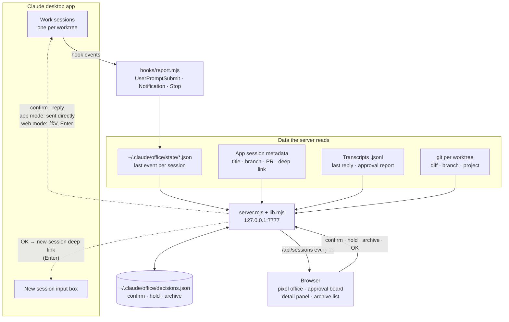

# Claude Office

[한국어](README.md) | **English**

A local dashboard for running several Claude Code sessions (Claude desktop app, Code tab) in parallel. Each session is a pixel-art animal "employee" at a desk. When one finishes, its report lands in an approval board (kanban), where you read the report and the git diff, then confirm.
Design notes (Korean): [`docs/specs/2026-09-25-claude-office-design.md`](docs/specs/2026-09-25-claude-office-design.md)


| Detail panel · report | Detail panel · changes |
|---|---|
|  |  |

- Zero dependencies (Node 22 standard library + `git`)
- Binds to `127.0.0.1:7777` only
- macOS only (uses the Claude desktop app's local files, `open`, and `pbcopy`). Compatibility and verification status (Korean): [`docs/research/2026-09-28-compat-and-verification.md`](docs/research/2026-09-28-compat-and-verification.md)
- The UI and the report format are in Korean

## Architecture



- Session state comes from hook events; titles, branches, and deep links from the app's files; changes from each worktree's git.
- The server writes only to `~/.claude/office/`. It only reads app data and session files.
- Whenever something goes to a session (confirm, OK), you press the final Enter yourself.

## Try the demo first (touches no real settings)

```bash
node scripts/demo.mjs public 7770
```

Ten fake sessions change state every 8 seconds. Open `http://127.0.0.1:7770`.

## Use it for real

1. Install the hooks. This backs up `~/.claude/settings.json`, then adds `UserPromptSubmit` / `Notification` / `Stop` hooks.
   ```bash
   node install.mjs
   ```
2. Add the report rule: append [`CLAUDE-report-rule.md`](CLAUDE-report-rule.md) to `~/.claude/CLAUDE.md`. Sessions then end finished work with a `## 결재 보고` ("approval report") block the dashboard can parse.
3. Start the server and open `http://127.0.0.1:7777`.
   ```bash
   node server.mjs
   ```
4. Give a new session a task in the app. Its employee starts typing. When it finishes, it raises a hand ("보고드려요", "reporting in"). Click the card to read the report and diff, then open the chat or confirm.

To open a session's panel directly: `http://127.0.0.1:7777/?open=<session id>` (add `&tab=diff` for the changes tab).

Hooks only see turns that start **after** installation. Older sessions active in the last 24 hours show up grey (state unknown).

## Run modes: web · app

| | Web mode | App mode |
|---|---|---|
| Start | `node server.mjs` | Double-click `~/Applications/Claude Office.app` (build it once with `node scripts/make-app.mjs`) |
| Dashboard · report · diff · hold · archive | ✅ | ✅ |
| Confirm | Copies the instruction and opens the chat → ⌘V, Enter | **Sends directly** |
| Reply box | Hidden | Shown. Enter **sends directly** (Shift+Enter for a newline) |
| Permissions | None | Accessibility (Claude Office); allow Automation on the first send |
| Terminal window | Must stay open | Not needed (runs in the background) |

### App mode setup (once)

1. Build the app
   ```bash
   node scripts/make-app.mjs
   ```
2. System Settings → Privacy & Security → Accessibility → `+` → ⌘⇧G → `~/Applications/Claude Office.app` → turn it on
3. Double-click `~/Applications/Claude Office.app`. It starts the server in the background and opens the dashboard; if the server is already running, it only opens the dashboard.
4. On the first direct send, if macOS asks whether "Claude Office" may control System Events / Claude, click **Allow**.
5. (Optional) Add Claude Office to System Settings → General → Login Items so it starts when you log in.

- Rebuilding the app (running `make-app.mjs` again) makes macOS treat it as a new app. Remove the old Accessibility entry and add it again.
- Server log: `~/.claude/office/server.log`. Stop: `lsof -ti tcp:7777 -sTCP:LISTEN | xargs kill`

### Why a direct send can't land in the wrong chat

1. It puts the text on the clipboard and opens that chat.
2. It checks the app's session file: that session's `lastFocusedAt` must have just moved (the app switched to that chat). If the chat was already on screen, it must be the most recently focused session.
3. Only then, with the Claude app frontmost, it presses ⌘V and Enter, and restores your previous clipboard.
4. If it can't confirm, it types nothing. The text stays on the clipboard for a manual ⌘V, Enter.

## Board columns

| Column | Meaning |
|---|---|
| 작업 중 (working) | The session is running |
| 결재 대기 (awaiting approval) | Finished with a report, asked a question, or blocked on a permission prompt (red "막힘" tag) |
| 보류 (on hold) | You parked it |
| 완료 (done) | You confirmed it |

## Confirm and next task

1. **컨펌 · 커밋·PR** (confirm · commit/PR) hands the session a "commit → PR → recommend next tasks" instruction: sent directly in app mode; in web mode it is copied and the chat opens, then ⌘V, Enter.
2. When a report includes a `### 다음 작업` (next tasks) section, press **OK · 1번 진행** (OK · run #1), or pick another number. A new session opens with the prompt filled in. Press Enter.

## Hold, archive, and the archive list

- **보류** (hold) moves the card to the hold column and does nothing else. Held cards stay on the board past 24 hours.
- **아카이브** (archive) removes the card from the office and the board. **모두 아카이브** (archive all) in the done column's header clears that column in one click.
- **🗄️ 보관함** (archive list, in the header) lists archived work as name · date · one-line summary. **복구** (restore) puts it back in the hold column.
- If you send a new prompt to a held, archived, or confirmed session, it returns to its normal state automatically.

## Uninstall

```bash
node install.mjs --uninstall
```

Then delete the `## 결재 보고 (Claude Office)` block from `~/.claude/CLAUDE.md` and run `rm -rf ~/.claude/office`. The dashboard only reads app data and sessions, so nothing else changes.

## Tests

```bash
npm test
node scripts/metrics.mjs
```

## Known limits

- Session titles and chat deep links come from the desktop app's internal files (`~/Library/Application Support/Claude/claude-code-sessions`). They are not a public API. If an app update changes them, titles fall back to folder names and deep links disappear. State tracking keeps working because it uses hooks.
- Hooks are registered with this folder's absolute path. If you move the folder, run `node install.mjs` again. Until you do, the hook exits with an error; sessions keep working but may show a hook error.
- The app blanks `q` on existing-chat links (only the new-session link `claude://code/new?q=…` fills the input box). So direct send types ⌘V, Enter in app mode, and web mode uses the clipboard plus opening the chat.
- Direct send's on-screen check relies on `lastFocusedAt` in the app's internal session files. If an app update changes that field, the check fails and direct send stops (it never sends to the wrong place).
- The dashboard parses the Korean `## 결재 보고` heading and its sub-headings exactly as written.
