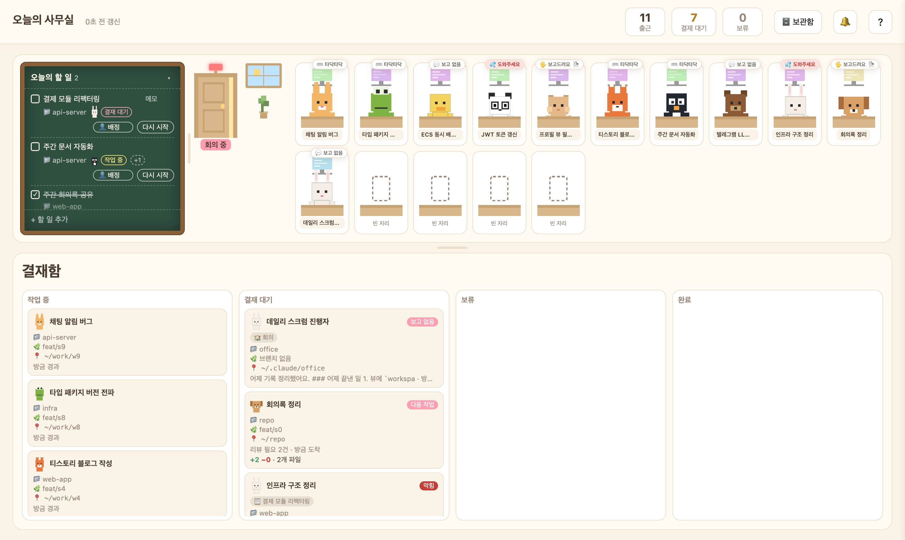
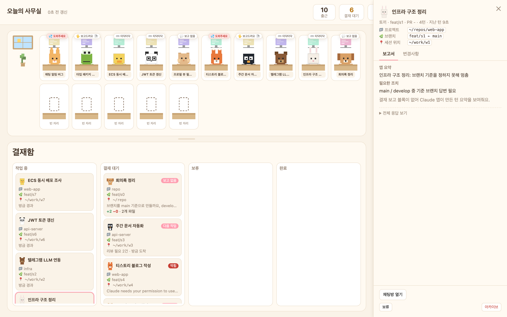
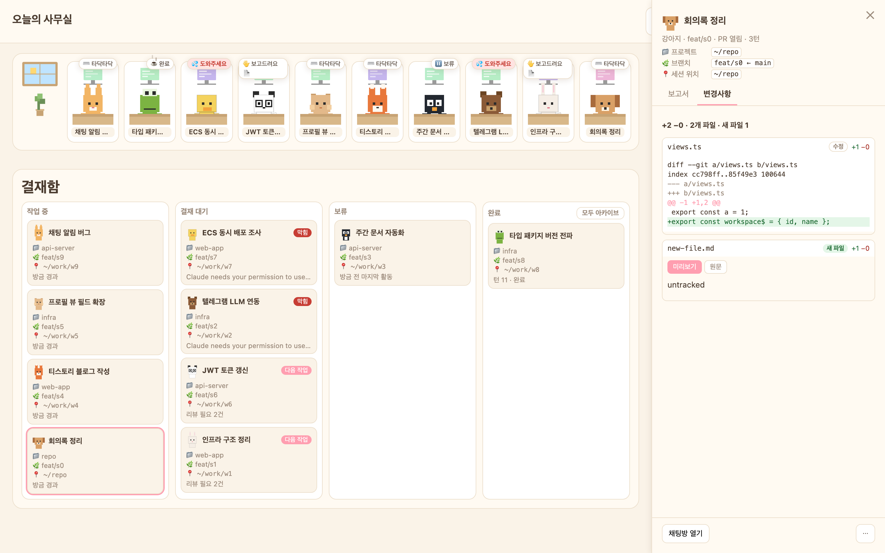
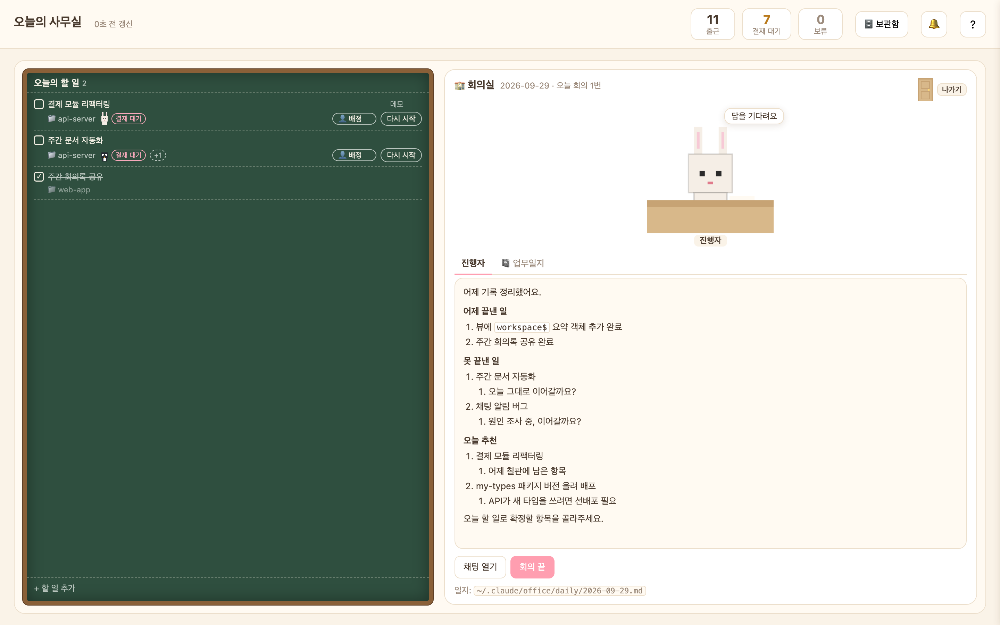
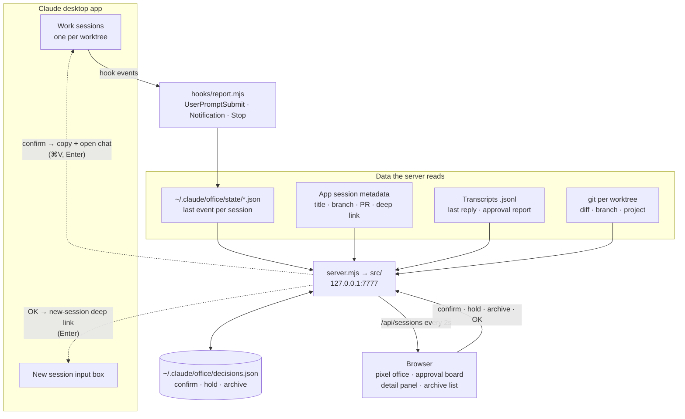

# Claude Office

[한국어](README.md) | **English**

A local dashboard for running several Claude Code sessions (Claude desktop app, Code tab) in parallel. Each session is a pixel-art animal "employee" at a desk. When one finishes, its report lands in an approval board (kanban), where you read the report and the git diff, then confirm.
Design notes (Korean): [`docs/specs/2026-09-25-claude-office-design.md`](docs/specs/2026-09-25-claude-office-design.md)



| Detail panel · report | Detail panel · changes |
|---|---|
|  |  |



- Zero dependencies (Node 22 standard library + `git`)
- Binds to `127.0.0.1:7777` only
- macOS only (uses the Claude desktop app's local files, `open`, and `pbcopy`). Compatibility and verification status (Korean): [`docs/research/2026-09-28-compat-and-verification.md`](docs/research/2026-09-28-compat-and-verification.md)
- The UI and the report format are in Korean

## Architecture



- Session state comes from hook events; titles, branches, and deep links from the app's files; changes from each worktree's git.
- The server writes only to `~/.claude/office/`. It only reads app data and session files.
- Whenever something goes to a session (confirm, OK), you press the final Enter yourself.

### Code layout

```
server.mjs              entry (runs src/http/server.mjs)
install.mjs             install / uninstall hooks
hooks/report.mjs        the hook (standalone, no imports, for startup speed)
bin/office.mjs          blackboard CLI (used by the meeting facilitator and by you; no server needed)
src/
  config.mjs            env vars, paths, limits (the only place env vars are read)
  http/                 controller: normalize input → call a use case → respond; Host/Origin checks
  usecases/             flows: session list, changes, confirm/hold/archive, next task, summary, todo ↔ session links, meetings
  domain/               pure functions: status, report parsing, prompts, diff parsing, todo rules, daily note, facilitator guide
  sources/              data in/out: app session files, hook state, transcripts, decisions, git
  platform/             OS side effects: open, pbcopy, claude -p
public/
  index.html            markup skeleton
  css/                  base · office · board · panel · changes · markdown
  js/                   main → api · store → views/ · panel/
  js/lib/               import-free modules: math (grid-math, markdown) and small DOM helpers (splitter, inline-edit)
  js/views/             office, board, header, blackboard (blackboard.js), meeting room (meeting.js). columns.js (columns) and filters.js (filters) are rule tables
  js/panel/             detail panel. actions.js (buttons) is a rule table
test/unit/              pure-function tests
test/integration/       server, fixtures, temp git repos
```

- Dependencies point one way: `http → usecases → domain · sources · platform`. `domain/` is pure (no files, no processes). `public/js/lib/`, `panel/actions.js` and `views/columns.js` import nothing.
- Rules live in tables. A new column, drop rule, filter, button, or editable field is one more row (where: [design §4](docs/specs/2026-09-28-board-interactions-design.md#4-확장-지점-나중에-기능을-붙이는-곳), Korean).
- The server (`src/domain/board.mjs`) decides which column a session is in and where it may be dropped, and sends that as `column` and `moves`. The page only displays it.
- File writes and OS commands live only in `sources/` and `platform/`.
- Design (Korean): [layering and detail panel](docs/specs/2026-09-28-layering-and-panel-design.md), [board interactions](docs/specs/2026-09-28-board-interactions-design.md), [todo blackboard](docs/specs/2026-09-28-todo-blackboard-design.md), [meeting room](docs/specs/2026-09-29-meeting-room-design.md)

## Try the demo first (touches no real settings)

```bash
node scripts/demo.mjs public 7770
```

Ten fake sessions change state every 8 seconds. Open `http://127.0.0.1:7770`.

## Use it for real

1. Install the hooks. This backs up `~/.claude/settings.json`, then adds `UserPromptSubmit` / `Notification` / `Stop` hooks.
   ```bash
   node install.mjs
   ```
2. Add the report rule: append [`CLAUDE-report-rule.md`](CLAUDE-report-rule.md) to `~/.claude/CLAUDE.md`. Sessions then end finished work with a `## 결재 보고` ("approval report") block the dashboard can parse.
3. Start the server and open `http://127.0.0.1:7777`.
   ```bash
   node server.mjs
   ```
4. Give a new session a task in the app. Its employee starts typing. When it finishes, it raises a hand ("보고드려요", "reporting in"). Click the card to read the report and diff, then open the chat or confirm.

To open a session's panel directly: `http://127.0.0.1:7777/?open=<session id>` (add `&tab=diff` for the changes tab).

Hooks only see turns that start **after** installation. Older sessions active in the last 24 hours show up grey (state unknown).

## Office and board

- **Seats**: desks open five at a time and there is always an empty one (7 sessions → 10 desks, 10 → 15). A row holds at most 10 desks, then wraps. An employee keeps their desk.
- **Resize**: drag the handle between the office and the board to change their heights, and the handles between board columns to change column widths. Desk size follows the office size and head count. Double-click resets; sizes are saved in the browser. Below 800px wide the page just flows top to bottom, without handles.
- **Drag cards**: while you drag a card, the columns that accept it show a dashed border and a label.

  | Drop on | Effect | Allowed from |
  |---|---|---|
  | 보류 (hold) | Hold, same as the hold button | working, awaiting approval, done |
  | 완료 (done) | Marks it done only. No commit/PR (that's the confirm button) | awaiting approval, hold |
  | Its original column (working or awaiting approval) | Undo the hold / done | hold, done |
  | The header's 🗄️ 보관함 (archive list) button | Archive, same as the archive button | any card |

- **Filter**: click the **결재 대기** (awaiting approval) or **보류** (hold) count in the header to see only those sessions (just their desks, and that one column, wide). Click **출근** (checked in) to see everyone again.

## Today's todo blackboard

A chalkboard on the office's left wall holds today's todos. Each item has a **시작** (start) button that opens a new session for that job — like assigning a PR to an issue.

1. **+ 할 일 추가** (add): title, project folder (pick one of the folders recent sessions used, or type a path), optional notes. Enter saves, Esc cancels.
2. **Start** opens a new-session input box with the prompt filled in (just press Enter). Its first line is `📋 오늘의 할 일 #todo-a1b2c3 · <title>`; the server finds that marker in the session's transcript and links the session to the todo. Sessions started from it with "다음 작업 ▶ 진행" inherit the marker and stay linked.
3. The linked worker's face and a status chip appear on the item; clicking it opens that session's panel. Board cards and the panel show a 📋 tag too.
4. Todo status is computed by the server from the linked session.

   | Linked session | Todo |
   |---|---|
   | none | open |
   | working · awaiting approval · on hold · stale | in progress |
   | confirmed · archived | done (struck through for the rest of the day, hidden after midnight) |
   | manual check / uncheck | whichever is newer, the check or the session decision, wins |

5. Deleting can be undone for 5 seconds; the board folds (▾) and its width is draggable.
6. Storage is one file, `~/.claude/office/todos.json`. Links and status are never stored — they are derived on every read.

## Meeting room (daily scrum)

**🏫 회의실** in the header switches the screen to the meeting room: the todo blackboard on the left, the facilitator's seat on the right. It is where yesterday gets summarized and today's todos get brainstormed.

1. **회의 시작** (start): the server writes today's note, `~/.claude/office/daily/YYYY-MM-DD.md` (sessions active since yesterday 00:00 with status, one-line summary and next-task suggestions; the blackboard as it is; recent project folders), then opens a new-session input for the facilitator (just press Enter).
2. **The facilitator is a real Claude Code session.** It first reads the guide file named in its prompt, `~/.claude/office/CLAUDE.md` (managed by the server), and follows it (the app may open the session in a scratch workspace, so the guide is not left to the folder's CLAUDE.md). It reads only today's note and what you say; no repo or vault digging, no code edits, no git. Its first message lists "finished yesterday / not finished / suggested for today", and the conversation happens in the app's chat.
3. Agreed items are written by the facilitator through the **blackboard CLI** (you can use it too):
   ```bash
   node bin/office.mjs todo list
   node bin/office.mjs todo add "title" --folder /abs/path [--detail "…"] [--source scrum]
   node bin/office.mjs todo update <id> [--title …] [--detail …] [--folder …] [--done true|false]
   node bin/office.mjs todo delete <id>
   node bin/office.mjs folders
   ```
   Items added in a meeting carry a 🏫 mark on the blackboard. The meeting screen refreshes the facilitator's latest message and the blackboard every 2 seconds.
4. **회의 끝** (end): archives the facilitator session and appends a `## 회의 n` section (the agreed todos, the facilitator's last message) to the note. You can hold several meetings a day. Only the note's auto block (`<!-- office:auto:start -->` … `end -->`) is regenerated at each start; everything else is kept.
5. The app may ask for Bash permission each time the facilitator runs the CLI. To stop that, allow just that command in `~/.claude/office/.claude/settings.json` (this app never writes it).

## Detail panel

- **Report tab**: the approval report rendered as markdown. Each "다음 작업" (next task) item has its own **▶ 진행** (run) button.
- **Changes tab**: first shows what it compared against (base branch) and `+added −deleted · files · new files`. New files show their **full content** whether committed or not, and new `.md` files switch between **미리보기 / 원문** (preview / raw); the preview shows a file's YAML frontmatter as a small table, and `[[path|label]]` links show just their label, with the path on hover (code is left as written). Sessions opened without a worktree are compared in their folder's git repo. When there are no changes, it says why. It reloads when the session moves on.
- **Footer**: row 1 is the primary action and "채팅방 열기" (open chat). The primary action is "컨펌 · 커밋·PR" (confirm) while awaiting approval, or "OK · 1번 진행 ▾" (run next task #1, ▾ for #2/#3) when next tasks exist. Row 2 holds the rest (summary, hold, …), with archive in red at the far right.
- **Rename**: click the name at the top of the panel to edit it. Enter or clicking elsewhere saves, Esc cancels, and saving it empty brings back the app's name. The new name is dashboard-only; the Claude app's sidebar keeps its own.
- **Resize**: drag the panel's left edge, or focus the handle and use ←/→; double-click resets the width. The width is saved in the browser.

## Board columns

| Column | Meaning |
|---|---|
| 작업 중 (working) | The session is running |
| 결재 대기 (awaiting approval) | Finished with a report, asked a question, or blocked on a permission prompt (red "막힘" tag) |
| 보류 (on hold) | You parked it |
| 완료 (done) | You confirmed it |

## Confirm and next task

1. **컨펌 · 커밋·PR** (confirm · commit/PR) copies an instruction to the clipboard and opens that chat. Press ⌘V, then Enter. The session commits, pushes, opens a PR, and recommends next tasks.
2. When a report includes a `### 다음 작업` (next tasks) section, press **OK · 1번 진행** (OK · run #1), or pick another number. A new session opens with the prompt filled in. Press Enter.

## Hold, archive, and the archive list

- **보류** (hold) moves the card to the hold column and does nothing else. Held cards stay on the board past 24 hours.
- **아카이브** (archive) removes the card from the office and the board. **모두 아카이브** (archive all) in the done column's header clears that column in one click.
- **🗄️ 보관함** (archive list, in the header) lists archived work as name · date · one-line summary. **복구** (restore) puts it back in the hold column.
- If you send a new prompt to a held, archived, or confirmed session, it returns to its normal state automatically.

## Uninstall

```bash
node install.mjs --uninstall
```

Then delete the `## 결재 보고 (Claude Office)` block from `~/.claude/CLAUDE.md` and run `rm -rf ~/.claude/office` (decisions, renames, todos, daily notes and the facilitator guide live there). The dashboard only reads app data and sessions, so nothing else changes.

## Tests

```bash
npm test
node scripts/metrics.mjs
```

## Known limits

- Session titles and chat deep links come from the desktop app's internal files (`~/Library/Application Support/Claude/claude-code-sessions`). They are not a public API. If an app update changes them, titles fall back to folder names and deep links disappear. State tracking keeps working because it uses hooks.
- Hooks are registered with this folder's absolute path. If you move the folder, run `node install.mjs` again. Until you do, the hook exits with an error; sessions keep working but may show a hook error.
- No deep link that fills an existing chat's input box was found in the app, so confirm goes through the clipboard (⌘V, Enter). New sessions use the `claude://code/new?q=…` deep link, which fills the input box without sending it.
- You talk to the meeting facilitator in the app's chat; the meeting screen shows only its latest message.
- Meetings and notes use the server's local date. A meeting that crosses midnight is no longer found as "today's".
- Todo ↔ session links rely on the `#todo-…` marker in a new session's first prompt. Delete that line before sending and the session won't link (start it from the blackboard again).
- Dragging cards needs a mouse. From the keyboard, the detail panel's hold / unhold / confirm buttons do the same.
- The dashboard parses the Korean `## 결재 보고` heading and its sub-headings exactly as written.
