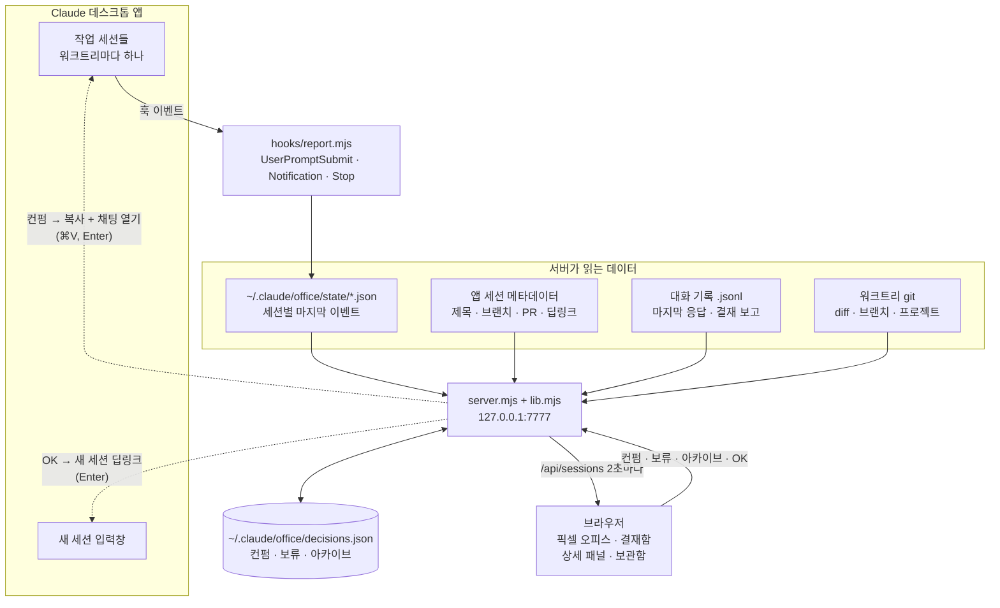

# Claude Office

**한국어** | [English](README.en.md)

병렬로 돌리는 Claude Code(데스크톱 앱) 세션을 픽셀 오피스로 관제하고, 결재함(칸반)에서 보고서·diff를 확인한 뒤 컨펌하는 로컬 대시보드.
설계: [`docs/specs/2026-09-25-claude-office-design.md`](docs/specs/2026-09-25-claude-office-design.md)


| 상세 패널 · 보고서 | 상세 패널 · 변경사항 |
|---|---|
|  |  |

- 의존성 0개 (Node 22 표준 라이브러리 + `git`)
- `127.0.0.1:7777` 전용

## 구조



- 세션 상태는 hooks가 남긴 이벤트로, 제목·브랜치·딥링크는 앱 파일에서, 변경사항은 각 워크트리의 git에서 읽는다.
- 서버가 쓰는 곳은 `~/.claude/office/` 하나다. 앱 데이터와 세션 파일은 읽기만 한다.
- 세션에 무언가를 보낼 때(컨펌, OK)는 마지막 Enter를 항상 사용자가 누른다.

## 먼저 데모로 보기 (실제 설정 안 건드림)

```bash
node scripts/demo.mjs public 7770
```

가짜 세션 10개가 8초마다 상태를 바꾼다. `http://127.0.0.1:7770`

## 실제로 쓰기

1. hooks 설치 (`~/.claude/settings.json` 백업 후 `UserPromptSubmit` / `Notification` / `Stop` 추가)
   ```bash
   node install.mjs
   ```
2. 보고 규칙 추가: [`CLAUDE-report-rule.md`](CLAUDE-report-rule.md) 내용을 `~/.claude/CLAUDE.md` 끝에 붙인다.
3. 서버 실행 후 `http://127.0.0.1:7777`
   ```bash
   node server.mjs
   ```
4. 앱에서 새 세션에 작업 지시 → 사원이 타이핑 → 끝나면 "보고드려요" → 카드 클릭 → 보고서/변경사항 확인 → 채팅방 열기 또는 컨펌.

특정 세션 패널을 바로 여는 주소: `http://127.0.0.1:7777/?open=<세션 id>` (변경사항 탭은 `&tab=diff`).

hooks는 설치 **이후** 시작된 턴부터 잡힌다. 설치 전 세션은 24시간 이내 활동분만 회색(상태 미상)으로 보인다.

## 컨펌과 다음 작업

1. **컨펌 · 커밋·PR**을 누르면 지시문이 클립보드에 복사되고 채팅방이 열린다. ⌘V, Enter를 누르면 세션이 커밋 → PR → 다음 작업 추천을 한다.
2. 세션이 `### 다음 작업`이 담긴 보고를 올리면 **OK · 1번 진행**(또는 N번 진행)을 누른다. 새 세션 입력창이 채워진 채 열리고, Enter만 누르면 된다.

## 보류 · 아카이브 · 보관함

- **보류**: 아무 동작 없이 결재함의 보류 칸으로 옮긴다. 24시간이 지나도 보드에 남는다.
- **아카이브**: 사무실과 결재함에서 뺀다. 완료 칸 헤더의 **모두 아카이브**로 한 번에 비울 수 있다.
- **🗄️ 보관함**(헤더): 아카이브한 작업을 작업 이름 · 날짜 · 한 줄 요약으로 보여주고, **복구**하면 보류 칸으로 돌아온다.
- 보류·아카이브·컨펌한 세션에 다시 지시를 보내면 자동으로 원래 상태로 돌아온다.

## 롤백

```bash
node install.mjs --uninstall
```

그리고 `~/.claude/CLAUDE.md`의 결재 보고 블록 삭제, `rm -rf ~/.claude/office`. 앱 데이터와 세션은 읽기만 하므로 영향 없음.

## 검증

```bash
npm test
node scripts/metrics.mjs
```

## 알려진 한계

- 세션 제목·딥링크는 앱 내부 파일(`~/Library/Application Support/Claude/claude-code-sessions`)에서 읽는다. 공개 API가 아니라 앱 업데이트로 바뀌면 제목이 폴더명으로, 딥링크가 사라진다(상태 추적은 hooks라 유지).
- hooks 경로는 이 폴더의 절대경로로 등록된다. 폴더를 옮기거나 워크트리를 지우면 `node install.mjs`를 다시 실행해야 한다(파일이 없으면 hook이 exit 1로 끝나 세션은 계속 동작하지만 hook 오류 표시가 뜰 수 있다).
- 앱의 기존 세션 입력창을 채우는 딥링크를 앱 코드에서 찾지 못해서, 컨펌은 클립보드 복사 + 채팅방 열기(⌘V, Enter)로 전달한다. 새 세션은 `claude://code/new?q=…` 딥링크로 입력창을 채운다(Enter만 누르면 됨).
- 화면과 보고 규칙은 한국어다. 대시보드는 `## 결재 보고` 제목과 소제목을 그대로 파싱한다.
