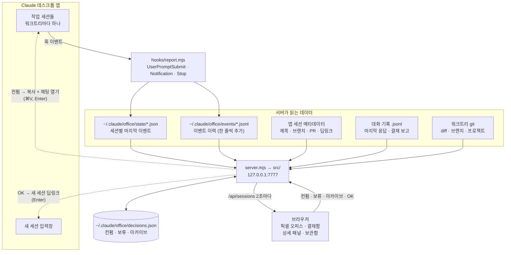

# Claude Office

**한국어** | [English](README.en.md)

병렬로 돌리는 Claude Code(데스크톱 앱) 세션을 픽셀 오피스로 관제하고, 결재함(칸반)에서 보고서·diff를 확인한 뒤 컨펌하는 로컬 대시보드.
설계: [`docs/specs/2026-09-25-claude-office-design.md`](docs/specs/2026-09-25-claude-office-design.md)


| 상세 패널 · 보고서 | 상세 패널 · 변경사항 |
|---|---|
|  |  |

- 의존성 0개 (Node 22 표준 라이브러리 + `git`)
- `127.0.0.1:7777` 전용
- macOS 전용 (앱 로컬 파일, `open`, `pbcopy` 사용). 호환성·검증 상태: [`docs/research/2026-09-28-compat-and-verification.md`](docs/research/2026-09-28-compat-and-verification.md)

## 구조



- 세션 상태는 hooks가 남긴 이벤트로, 제목·브랜치·딥링크는 앱 파일에서, 변경사항은 각 워크트리의 git에서 읽는다.
- 서버가 쓰는 곳은 `~/.claude/office/` 하나다. 앱 데이터와 세션 파일은 읽기만 한다.
- 세션에 무언가를 보낼 때(컨펌, OK)는 마지막 Enter를 항상 사용자가 누른다.

### 코드 구조

```
server.mjs              진입점 (src/http/server.mjs 실행)
install.mjs             hooks 설치·제거
hooks/report.mjs        hook (실행 속도 때문에 의존성 없이 단독)
bin/office.mjs          업무일지 CLI (`narrate`, 서버 불필요)
src/
  config.mjs            환경변수·경로·한도 (환경변수는 여기서만 읽음)
  http/                 controller: 입력 정리 → use-case 호출 → 응답, Host/Origin 검사
  usecases/             흐름: 세션 목록, 변경사항, 컨펌·보류·아카이브, 다음 작업, 요약, 업무일지(어제 세션 정리·AI 서술)
  domain/               순수 함수: 상태 판정, 대기·턴 시간(timeline), 보고서 파싱, 프롬프트, diff 파싱, 일지
  sources/              데이터 읽기·쓰기: 앱 세션 파일, hook 상태·이벤트 이력, 대화 기록, 결정, git
  platform/             OS 부수효과: open, pbcopy, claude -p
public/
  index.html            마크업 뼈대
  css/                  base · office · board · panel · changes · markdown
  js/                   main → api · store → views/ · panel/
  js/lib/               import 없는 모듈: 계산(grid-math, markdown)과 작은 DOM 도구(splitter, inline-edit)
  js/views/             사무실·결재함·헤더(갱신 표시 freshness.js)·업무일지(journal.js). columns.js(칸)·filters.js(필터)는 규칙 표
  js/panel/             상세 패널. actions.js(버튼)는 규칙 표
test/unit/              순수 함수 테스트
test/integration/       서버·fixture·임시 git 레포 테스트
```

- 의존 방향: `http → usecases → domain · sources · platform`. `domain/`은 파일·프로세스에 접근하지 않는 순수 함수다. `public/js/lib/`, `panel/actions.js`, `views/columns.js`는 아무것도 import하지 않는다.
- 규칙은 표로 둔다. 새 칸·드래그 규칙·필터·버튼·편집 필드는 표에 한 줄을 더하면 된다(고칠 곳: [설계 §4](docs/specs/2026-09-28-board-interactions-design.md#4-확장-지점-나중에-기능을-붙이는-곳)).
- 세션이 어느 칸에 있고 어디로 옮길 수 있는지는 서버(`src/domain/board.mjs`)가 계산해 `column`, `moves`로 내려준다. 화면은 그대로 보여주기만 한다.
- 파일 쓰기와 OS 명령은 `sources/`와 `platform/`에만 있다.
- 설계 문서: [레이어·상세 패널](docs/specs/2026-09-28-layering-and-panel-design.md), [결재함 상호작용](docs/specs/2026-09-28-board-interactions-design.md), [AI 서술](docs/specs/2026-09-29-daily-narrative-design.md), [이벤트 이력](docs/specs/2026-09-29-event-history-design.md), [할 일 칠판·회의실 제거](docs/specs/2026-10-01-remove-todo-blackboard.md), 제품 리뷰: [`docs/product-review-20260929.md`](docs/product-review-20260929.md)

## 먼저 데모로 보기 (실제 설정 안 건드림)

```bash
node scripts/demo.mjs public 7770
```

가짜 세션 10개가 8초마다 상태를 바꾼다. `http://127.0.0.1:7770`

## 실제로 쓰기

1. hooks 설치 (`~/.claude/settings.json` 백업 후 `UserPromptSubmit` / `Notification` / `Stop` hooks 추가)
   ```bash
   node install.mjs
   ```
2. 보고 규칙 추가: [`CLAUDE-report-rule.md`](CLAUDE-report-rule.md) 내용을 `~/.claude/CLAUDE.md` 끝에 붙인다.
3. 서버 실행 후 `http://127.0.0.1:7777`
   ```bash
   node server.mjs
   ```
4. 앱에서 새 세션에 작업 지시 → 사원이 타이핑 → 끝나면 "보고드려요" → 카드 클릭 → 보고서/변경사항 확인 → 채팅방 열기 또는 컨펌.

특정 세션 패널을 바로 여는 주소: `http://127.0.0.1:7777/?open=<세션 id>` (변경사항 탭은 `&tab=diff`).

회의실이 있던 버전을 설치했다면 원래 체크아웃에서 `node install.mjs`를 한 번 더 실행한다. 그때 넣은 진행자 읽기 허용 규칙 2줄(`~/.claude/office/CLAUDE.md`, `~/.claude/office/daily/**`)을 지운다(워크트리에서 실행하면 hooks 경로가 그 워크트리로 바뀐다).

hooks는 설치 **이후** 시작된 턴부터 잡힌다. 설치 전 세션은 24시간 이내 활동분만 회색(상태 미상)으로 보인다. 앱 세션은 있는데 hook 기록이 하나도 없으면 헤더 아래에 `node install.mjs` 안내가 뜨고, 세션이 하나도 없으면 3단계 설치 안내가 뜬다.

### 항상 띄워 두기 (macOS)

`node server.mjs` 대신 사용자 LaunchAgent로 등록하면 로그인할 때 서버가 켜지고, 서버가 죽어도 10초쯤 뒤 다시 켜진다. 이 폴더에서 한 번 실행한다(시스템 설정이 아니라 `~/Library/LaunchAgents`의 사용자 항목이다).

```bash
mkdir -p ~/.claude/office && cat > ~/Library/LaunchAgents/local.claude-office.plist <<EOF
<?xml version="1.0" encoding="UTF-8"?>
<!DOCTYPE plist PUBLIC "-//Apple//DTD PLIST 1.0//EN" "http://www.apple.com/DTDs/PropertyList-1.0.dtd">
<plist version="1.0">
<dict>
  <key>Label</key><string>local.claude-office</string>
  <key>ProgramArguments</key>
  <array><string>$(command -v node)</string><string>$PWD/server.mjs</string></array>
  <key>WorkingDirectory</key><string>$PWD</string>
  <key>EnvironmentVariables</key>
  <dict><key>PATH</key><string>$(dirname "$(command -v node)"):$(dirname "$(command -v claude)"):/opt/homebrew/bin:/usr/local/bin:/usr/bin:/bin:/usr/sbin:/sbin</string></dict>
  <key>RunAtLoad</key><true/>
  <key>KeepAlive</key><true/>
  <key>ThrottleInterval</key><integer>10</integer>
  <key>StandardOutPath</key><string>$HOME/.claude/office/server.log</string>
  <key>StandardErrorPath</key><string>$HOME/.claude/office/server.log</string>
</dict>
</plist>
EOF
launchctl bootstrap gui/$(id -u) ~/Library/LaunchAgents/local.claude-office.plist
```

1. 서버 코드를 바꾼 뒤 재시작: `launchctl kickstart -k gui/$(id -u)/local.claude-office`
2. 등록 해제: `launchctl bootout gui/$(id -u)/local.claude-office` 후 `~/Library/LaunchAgents/local.claude-office.plist` 삭제
3. 로그: `~/.claude/office/server.log`
4. 등록해 둔 동안 `node server.mjs`를 따로 띄우지 않는다(포트 7777이 겹친다). 데모는 다른 포트(7770)라 괜찮다.
5. node 경로가 plist에 들어가므로 node 버전을 바꾸거나 폴더를 옮기면 등록 해제 후 위 블록을 다시 실행한다.

## 사무실과 결재함

- **헤더**: `출근`은 사무실에 앉은 세션 수(최근 24시간 + 보류, 최대 20석), `결재 대기`는 보고·보고 없음·막힘 세션 수이고 탭 제목 `(n) 결재 대기`와 같은 숫자다. 새 세션이 결재 대기에 들어오면(막힘 포함) 알림 소리와 브라우저 알림이 나간다. 옆의 `n초 전 갱신`은 마지막으로 서버에서 받아온 시각이고, 서버에 연결하지 못하면 빨간 **오프라인**으로 바뀐다(화면은 마지막 데이터 그대로). **?** 버튼은 말풍선·색·태그·숫자의 뜻을 보여준다.
- **말풍선**: ⌨️ 타닥타닥(작업 중) · 🖐️ 보고드려요(결재 보고 있음) · 💬 보고 없음(결재 보고 블록 없이 턴이 끝남) · 💦 도와주세요(권한 요청 등) · ☕ 완료 · ⏸️ 보류. 흑백 사원은 hook 기록이 없는 세션이다. API의 status 값은 그대로다(`question` = 보고 없음).
- **결재 대기 정렬**: 오래 기다린 카드가 위에 오고 카드에 `n분째 대기`가 붙는다. 대기 시각은 hook 이벤트 이력(`~/.claude/office/events/`)에서 계산한다(같은 이벤트가 이어지면 처음 멈춘 때부터). 이력이 없는 세션은 마지막 이벤트 시각을 쓴다.
- **좌석**: 5석 단위로 늘어나고 빈자리가 항상 남는다(세션 7개 → 10석, 10개 → 15석). 한 줄에 최대 10석이고 넘으면 줄을 바꾼다. 한 번 앉은 사원은 같은 자리를 지킨다.
- **크기 조절**: 사무실과 결재함 사이 손잡이로 높이를, 결재함 칸 사이 손잡이로 칸 폭을 바꾼다. 책상 크기는 사무실 크기와 인원에 맞춰 자동으로 정해진다. 더블클릭하면 기본값, 크기는 브라우저에 저장된다. 800px 미만 화면에서는 손잡이 없이 위에서 아래로 흐른다.
- **카드 끌어 옮기기**: 카드를 끌면 놓을 수 있는 칸에 점선과 안내 문구가 뜬다.

  | 놓는 칸 | 하는 일 | 가능한 카드 |
  |---|---|---|
  | 보류 | 보류 (보류 버튼과 같음) | 작업 중, 결재 대기, 완료 |
  | 완료 | 상태만 완료. 커밋·PR은 하지 않음(컨펌 버튼 몫) | 결재 대기, 보류 |
  | 원래 칸 (작업 중 또는 결재 대기) | 보류·완료 되돌리기 | 보류, 완료 |
  | 헤더의 🗄️ 보관함 버튼 | 아카이브 (아카이브 버튼과 같음) | 모든 카드 |

- **필터**: 헤더의 **결재 대기**·**보류** 숫자를 누르면 그 세션만 보인다(사무실은 해당 책상만, 결재함은 그 칸만 넓게). **출근**을 누르면 전체로 돌아온다.

## 📓 업무일지

헤더의 **📓 업무일지**를 누르면 오늘 일지의 AI 서술(어제 이야기)이 뜬다. 어제 한 일을 세션 목록이 아니라 프로젝트별 이야기로 다시 보는 곳이다.

1. **지금 쓰기 / 다시 쓰기**: 모델(`claude -p`, haiku, 격리 호출)이 어제 세션들을 서술한다. 1~2분 걸리고 서버에서 백그라운드로 돌며, 창은 2초마다 진행 상태를 보여준다. 아래 일지 경로를 누르면 복사된다.
2. **일지 파일** `~/.claude/office/daily/YYYY-MM-DD.md`
   1. 자동 구간(`<!-- office:auto:start -->` … `end -->`): 어제 0시 이후 세션마다 상태·변경량·폴더·한 줄 요약·다음 작업 추천
   2. `## 어제 이야기` 구간(`<!-- office:narrative:start -->` … `end -->`): 프로젝트별 이야기와 "남은 것"
   3. 마커 밖에 직접 적은 메모는 그대로 둔다. Obsidian 같은 편집기로 열어도 된다.
3. **자동 작성**: 서버가 켜져 있으면 매일 05시 이후 한 번 쓴다. 서버 시작 때와 10분마다 확인하고, 이미 있으면 건너뛴다.
4. **CLI**: 서버 없이 지금 다시 쓰기(cron/launchd용)
   ```bash
   node bin/office.mjs narrate
   ```

오늘의 할 일 칠판, 세션 배정, 회의실은 2026-10-01에 뺐다. 실제로는 거의 쓰이지 않았고, 할 일은 결재 보고의 "다음 작업"과 **OK** 버튼이 세션 안에서 이미 맡고 있다. 이유와 되살리는 법: [제거 기록](docs/specs/2026-10-01-remove-todo-blackboard.md).

## 상세 패널

- **보고서 탭**: 결재 보고를 마크다운으로 보여준다. "다음 작업"은 항목마다 **▶ 진행** 버튼이 있다. 결재 보고가 없으면 요약 만들기 결과 → Claude 앱이 턴마다 만드는 요약(**앱 요약**, 모델 호출 없음) → 마지막 응답 전체 순으로 보여준다.
- **부제**: `동물 · 브랜치 · PR · n턴 · 지난 턴 n분`. 지난 턴은 이벤트 이력의 `UserPromptSubmit` → `Stop` 시간이다.
- **변경사항 탭**: 무엇과 비교했는지(기준 브랜치)와 `+추가 −삭제 · 파일 수 · 새 파일 수`를 먼저 보여준다. 새 파일은 커밋 여부와 상관없이 **내용 전체**가 보이고, 새 `.md` 파일은 **미리보기 / 원문**으로 전환되고, 미리보기에서는 파일 맨 위 YAML 메타데이터가 작은 표로 보이고, `[[경로|이름]]` 링크는 이름만 보이고 마우스를 올리면 경로가 뜬다(코드 안은 그대로). 워크트리 없이 연 세션도 그 폴더의 git 레포로 비교한다. 변경이 없으면 이유를 적는다. 세션이 새로 움직이면 자동으로 다시 불러온다.
- **하단 버튼**: 1줄은 주 버튼과 "채팅방 열기"다. 주 버튼은 결재 대기면 "컨펌 · 커밋·PR", 다음 작업이 있으면 "OK · 1번 진행 ▾"(▾로 2·3번 선택)이다. 2줄은 요약 만들기·보류 같은 나머지 버튼이고, 아카이브는 오른쪽 끝에 빨간 글씨로 있다. 버튼에 마우스를 올리면 누르면 무슨 일이 생기는지 나온다(예: OK = 이 세션 완료 + 새 세션 입력창, 컨펌 = 지시문 복사 + 채팅방 열기, 붙여넣기와 Enter는 직접).
- **이름 바꾸기**: 패널 위쪽 이름을 누르면 입력칸이 된다. Enter 또는 바깥 클릭이면 저장, Esc면 취소, 비우고 저장하면 앱 원래 이름으로 돌아간다. 대시보드에서만 바뀌고 Claude 앱 사이드바 이름은 그대로다.
- **크기 조절**: 패널 왼쪽 가장자리를 드래그한다. 손잡이에 포커스한 뒤 ←/→로 조절하고, 더블클릭하면 기본 폭으로 돌아온다. 폭은 브라우저에 저장된다.

## 컨펌과 다음 작업

1. **컨펌 · 커밋·PR**을 누르면 지시문이 클립보드에 복사되고 채팅방이 열린다. ⌘V, Enter를 누르면 세션이 커밋 → PR → 다음 작업 추천을 한다.
2. 세션이 `### 다음 작업`이 담긴 보고를 올리면 **OK · 1번 진행**(또는 N번 진행)을 누른다. 새 세션 입력창이 채워진 채 열리고, Enter만 누르면 된다.

## 보류 · 아카이브 · 보관함

- **보류**: 아무 동작 없이 결재함의 보류 칸으로 옮긴다. 24시간이 지나도 보드에 남는다.
- **아카이브**: 사무실과 결재함에서 뺀다. 완료 칸 헤더의 **모두 아카이브**로 한 번에 비울 수 있다.
- **🗄️ 보관함**(헤더): 아카이브한 작업을 작업 이름 · 날짜 · 한 줄 요약으로 보여주고, **복구**하면 보류 칸으로 돌아온다.
- 보류·아카이브·컨펌한 세션에 다시 지시를 보내면 자동으로 원래 상태로 돌아온다.

## 롤백

```bash
node install.mjs --uninstall
```

hooks만 빠진다(예전 버전이 넣은 진행자 읽기 허용 규칙도 함께). 그리고 `~/.claude/CLAUDE.md`의 결재 보고 블록 삭제, `rm -rf ~/.claude/office`(결정·이름·일지·이벤트 이력, 예전 버전의 할 일·연결 기록·진행자 지침 포함). 이벤트 이력만 지우려면 `rm -rf ~/.claude/office/events`(대기 시간이 마지막 이벤트 기준으로, 지난 턴 표시가 빈칸으로 돌아갈 뿐이다). 앱 데이터와 세션은 읽기만 하므로 영향 없음.

## 검증

```bash
npm test
node scripts/metrics.mjs
```

## 알려진 한계

- 세션 제목·딥링크는 앱 내부 파일(`~/Library/Application Support/Claude/claude-code-sessions`)에서 읽는다. 공개 API가 아니라 앱 업데이트로 바뀌면 제목이 폴더명으로, 딥링크가 사라진다(상태 추적은 hooks라 유지).
- hooks 경로는 이 폴더의 절대경로로 등록된다. 폴더를 옮기거나 워크트리를 지우면 `node install.mjs`를 다시 실행해야 한다(파일이 없으면 hook이 exit 1로 끝나 세션은 계속 동작하지만 hook 오류 표시가 뜰 수 있다).
- 앱의 기존 세션 입력창을 채우는 딥링크를 앱 코드에서 찾지 못해서, 컨펌은 클립보드 복사 + 채팅방 열기(⌘V, Enter)로 전달한다. 새 세션은 `claude://code/new?q=…` 딥링크로 입력창을 채운다(Enter만 누르면 됨).
- 일지는 서버의 로컬 날짜 기준이다.
- AI 서술은 서버 안 타이머라 서버가 꺼져 있으면 써지지 않는다(켜지면 바로 확인). 서버 없이 돌리려면 `node bin/office.mjs narrate`를 cron/launchd에 건다. 서술은 모델 요약이라 세션 두 개를 한 문장에 섞는 등 틀릴 수 있다.
- 카드 끌어 옮기기는 마우스 전용이다. 키보드로는 상세 패널의 보류·보류 해제·컨펌 버튼으로 같은 일을 한다.
- 이벤트 이력은 자동으로 지우지 않는다. 한 줄 50바이트 정도라 턴 200개짜리 세션도 30KB 안팎이고, 서버는 파일 끝 64KB만 읽는다.
- 토큰·비용은 아직 보여주지 않는다(대화 기록 전체를 증분으로 읽어야 해서 보류, [이벤트 이력 설계 §7](docs/specs/2026-09-29-event-history-design.md)).
- 화면과 보고 규칙은 한국어다. 대시보드는 `## 결재 보고` 제목과 소제목을 그대로 파싱한다.
