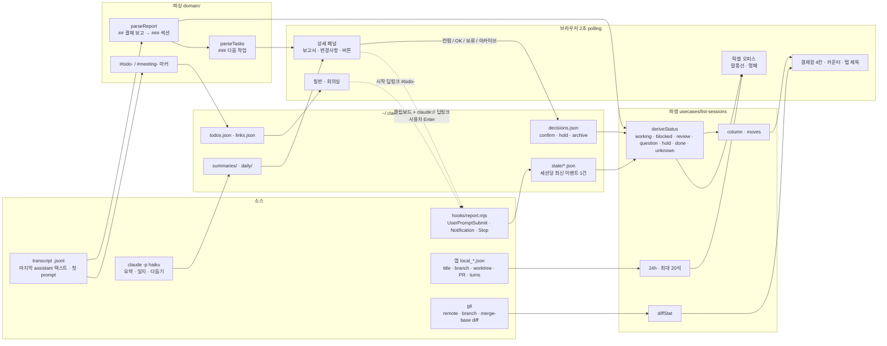

# claude-office 제품 리뷰 + 경쟁 분석 (2026-09-29)

## 목적

1. claude-office의 데이터 파이프라인(소스 → 파싱 → 가공 → 저장 → 이벤트 → 화면)을 코드 근거로 정리
2. README 없이 대시보드만 본 신규 사용자(Claude Code를 매일 쓰는 개발자/팀 리드)의 첫인상 사용성 판정
3. 유사 제품 5개와 비교하고, 이를 근거로 개선 우선순위와 차별점 제안

## 조사 방법

| 항목 | 방법 |
|---|---|
| 코드 기준 | `main` @ `09f8296` (2026-09-29). 경로는 레포 루트 기준 `파일:라인` |
| 화면 기준 | `node scripts/demo.mjs public 7770` (가짜 세션 10개, 임시 HOME)을 1440×900, 800×600으로 띄워 확인 |
| 실데이터 필드 확인 | `~/Library/Application Support/Claude/claude-code-sessions/**/local_*.json` 1개의 **키 목록**, 최신 transcript `.jsonl` 1개의 **레코드 type 분포**만 확인 (내용은 기록하지 않음) |
| 경쟁 제품 | 공식 문서·GitHub README·가격 페이지·GitHub API. 확인일 2026-09-29 |
| 표기 | 사실은 `파일:라인` 또는 URL로 근거를 단다. 추측은 "(추측)", 확인하지 못한 것은 "(미확인)". 4단계는 전부 의견 |

---

## 사실 1. 데이터 파이프라인

### 1.1 입력 소스

| # | 소스 | 위치 | 읽는 방식 / 주기 | 근거 |
|---|---|---|---|---|
| 1 | Hook 이벤트 | Claude Code가 `UserPromptSubmit`·`Notification`·`Stop` 때 `hooks/report.mjs` 실행 → `~/.claude/office/state/<session_id>.json`에 마지막 이벤트 1건 덮어쓰기 | push(hook). 서버는 요청마다 디렉터리 전체 read | `hooks/report.mjs:14-38`, `install.mjs:12,24-27`, `src/sources/hook-states.mjs:19-23` |
| 2 | 앱 세션 메타 | `~/Library/Application Support/Claude/claude-code-sessions/<uuid>/<uuid>/local_*.json` | 요청마다 스캔, mtime 캐시 | `src/config.mjs:9-10`, `src/sources/app-sessions.mjs:19-32` |
| 3 | Transcript `.jsonl` | hook이 준 `transcript_path`, 없으면 `~/.claude/projects/<cwd 치환>/<cli>.jsonl` | tail 256KB→4MB→전체로 넓혀 읽기(size+mtime 캐시), head 256KB(경로 캐시) | `src/usecases/list-sessions.mjs:68-71`, `src/sources/transcripts.mjs:6-7,32-56,61-81`, `src/config.mjs:30,33` |
| 4 | Git | 세션 worktree/cwd에서 `remote`, `rev-parse`, `merge-base`, `diff --shortstat`, `ls-files --others` | 요청 시 실행(3초 timeout). gitInfo는 10초 캐시, shortstat는 (세션, 이벤트 시각) 키 캐시 | `src/sources/git.mjs:8-14,27-42`, `src/usecases/list-sessions.mjs:34-51` |
| 5 | 대시보드 자체 저장소 | `~/.claude/office/`의 `decisions.json`·`confirmed.json`(구형)·`overrides.json`·`todos.json`·`links.json`·`summaries/*.md`·`daily/*.md` | 요청마다 read | `src/config.mjs:11-22`, `src/sources/decisions.mjs:8-11` |
| 6 | 모델 호출 결과 | `claude -p --model haiku --tools '' --no-session-persistence` (요약·일지 서술·다듬기) | 사용자 클릭 시, 또는 서버 타이머(10분 간격, 05시 이후 하루 1회) | `src/platform/claude-cli.mjs:5-16`, `src/config.mjs:39-42`, `src/http/server.mjs:61-66` |
| 7 | 회의 진행자 세션 응답 | `#meeting-` 마커가 있는 세션의 마지막 응답 속 `### 칠판` 목록 | 서버 타이머 3초 | `src/config.mjs:44`, `src/usecases/meeting.mjs:91-120` |

화면 갱신은 브라우저가 `GET /api/sessions` + `GET /api/todos`(회의실 화면이면 `GET /api/meeting`도)를 **2초마다 polling**한다 (`public/js/main.js:91-102,126`). 서버에는 push·watch가 없고, 요청이 올 때마다 위 소스를 다시 조합한다 (`src/http/routes.mjs:35`, `src/usecases/list-sessions.mjs:73-112`).

### 1.2 분해 (단위와 파싱 규칙)

| 단위 | 규칙 | 실패 시 동작 | 근거 |
|---|---|---|---|
| 세션 | hook state(`id`=CLI session id) ∪ 앱 세션(`cliSessionId`). 앱 세션이 있으면 `sessionId`가 대시보드 id | 앱 파일이 없으면 cli id 사용. 둘 다 없으면 안 보임 | `src/usecases/list-sessions.mjs:55-65` |
| 이벤트 | 세션당 **마지막 1건만** 보관 (`event, at, cwd, transcriptPath, message≤200자`). `Stop` 직후 오는 `Notification`은 무시 | JSON이 깨지면 해당 파일 skip. hook은 항상 exit 0 | `hooks/report.mjs:25-38,41-44`, `src/sources/hook-states.mjs:23` |
| 메시지 | transcript 뒤에서부터 `type==='assistant' && !isSidechain`인 첫 레코드의 `text` 블록만 이어 붙임 | 파싱 안 되는 줄은 null로 버림. 못 찾으면 `''` | `src/sources/transcripts.mjs:9-27` |
| 첫 프롬프트 | head 256KB에서 `type==='user' && !isMeta`인 첫 텍스트, `<system-reminder>` 제거 | 없으면 `''` | `src/sources/transcripts.mjs:83-99` |
| 결재 보고 | 마지막 assistant 텍스트에서 `^## 결재 보고$` 뒤부터 다음 `## ` 전까지를 `### ` 기준으로 나눠 `{섹션명: 본문}` | 헤더가 없으면 `null` → 상태는 `question` | `src/domain/report.mjs:3-18`, `src/domain/status.mjs:12` |
| 다음 작업 | `### 다음 작업` 본문의 `1.`/`-` 최상위 항목 = task, 들여쓴 줄 = detail | 항목이 없으면 `[]` → OK 버튼 대신 컨펌 버튼 | `src/domain/report.mjs:21-30`, `public/js/panel/actions.js:24-34` |
| 할 일 / 회의 연결 | 첫 프롬프트 head에서 `#todo-xxxxxx`, `#meeting-YYYY-MM-DD-n` 정규식 | 없으면 수동 배정(`todos.json`의 `assigned`) 조회 | `src/domain/todo.mjs:7-9,91`, `src/domain/meeting.mjs:8-11`, `src/usecases/list-sessions.mjs:101-108` |
| 회의 칠판 | 진행자 응답의 마지막 `### 칠판` 섹션 → `{title, folder, detail}` | 항목이 0개면 해시만 기록하고 skip | `src/domain/meeting.mjs:111,131-165`, `src/usecases/meeting.mjs:96-102` |
| Diff | `git diff <merge-base>` + untracked 파일을 `--no-index` 패치로 | 폴더 없음/git 아님 → reason 반환. 파일당 200KB, 전체 1MB, untracked 30개 한도 | `src/usecases/get-changes.mjs:24-30`, `src/config.mjs:35-37` |

### 1.3 조합·파생값

| 파생값 | 계산 | 근거 |
|---|---|---|
| `status` | 결정(decision)이 마지막 hook 이벤트보다 새로우면 `done`/`hold`/`archived`. 아니면 `UserPromptSubmit→working`, `Notification→blocked`, `Stop→(보고 있음 ? review : question)`, 이벤트 없음→`unknown` | `src/domain/status.mjs:3-14` |
| `column` / `moves` | `working→작업 중`, `review·question·blocked→결재 대기`, `hold→보류`, `done→완료`, `unknown·archived→보드 밖`. 드래그 허용 규칙 4줄 | `src/domain/board.mjs:5-23` |
| 노출 대상 | `lastAt`이 24시간 이내이거나 보류 중인 세션. 아카이브·앱 아카이브는 제외. 보류를 먼저 앉히고 최신순으로 **최대 20석** | `src/usecases/list-sessions.mjs:79-83`, `src/domain/status.mjs:17-20`, `src/config.mjs:29` |
| `lastAt` | `max(hook at, app lastActivityAt)` | `src/usecases/list-sessions.mjs:63` |
| `diffStat` | review/question일 때만. `merge-base(worktree, sourceBranch ‖ 'HEAD')` 기준 shortstat + untracked 추가 줄 수 | `src/usecases/list-sessions.mjs:22-51,96` |
| `repo` / `branch` | origin remote 이름 ‖ 폴더명 / 앱 branch ‖ git branch | `src/domain/session-view.mjs:23,32`, `src/sources/git.mjs:34-41` |
| `animal` / `repoHue` | 세션 id 해시 → 동물 10종, originCwd 해시 → 모니터 색상 | `src/domain/session-view.mjs:7-9,22-24` |
| `summary` | 요약 파일 mtime이 마지막 이벤트 시각 이후일 때만 유효 | `src/usecases/list-sessions.mjs:91-92` |
| `todo.status` | 연결 세션 중 최신 1개의 상태 → `open/started/done`. 수동 체크와는 시각을 비교해 더 최근 것을 따름 | `src/domain/todo.mjs:60-83` |
| "리뷰 필요 N건" | `리뷰 필요` 본문에서 `-`/`1.`로 시작하는 **들여쓰기 없는** 줄 수 (브라우저에서 계산) | `public/js/views/board.js:35-39` |
| 경과 시간 | `Date.now() - eventAt`을 분/시간/일로 (브라우저 시계 기준) | `public/js/views/board.js:27-34,55` |

계산하지 **않는** 값: 토큰·비용, 모델, 턴당 소요 시간, tool call 수, 에러율, 위험도 점수. 이 중 일부는 소스에 있다(1.7 표).

### 1.4 이벤트화 범위

명시적인 "이벤트 스키마"는 없다. 저장되는 이벤트성 레코드는 아래 셋이고, 나머지는 요청마다 raw 파일에서 다시 계산한다.

| 레코드 | 스키마 | 보존 | 근거 |
|---|---|---|---|
| Hook 상태 | `{event: 'UserPromptSubmit'\|'Notification'\|'Stop', at, cwd, transcriptPath, message}` | 세션당 최신 1건 덮어쓰기. 이력 없음 | `hooks/report.mjs:28-38` |
| 리드 결정 | `{kind: 'confirm'\|'hold'\|'archive', at}` + archive일 때만 `title, summary, lastAt` | 세션당 1건. 더 새로운 hook 이벤트가 오면 무효 | `src/usecases/decide.mjs:10-26`, `src/sources/decisions.mjs:5-12`, `src/domain/status.mjs:3` |
| 할 일 연결 스냅샷 | `links.json` (30일 지난 transcript 삭제 대비) | 누적 | `src/config.mjs:20`, `src/domain/todo.mjs:106-145` |

버려지거나 raw로만 남는 것:

1. `PreToolUse`·`PostToolUse`·`SessionStart`·`SubagentStop` 등 다른 hook 이벤트. 설치 대상이 아님 (`install.mjs:12`)
2. 이벤트 이력. 이전 이벤트는 덮어써짐 (`hooks/report.mjs:38`)
3. transcript의 tool_use/tool_result, thinking, user 메시지, usage(token). 읽지 않음 (`src/sources/transcripts.mjs:24-25`)
4. sidechain(서브에이전트) 응답. 명시적으로 제외 (`src/sources/transcripts.mjs:24`)
5. 마지막 assistant 응답보다 앞선 결재 보고. 마지막 응답만 파싱 (`src/usecases/list-sessions.mjs:87-88`)

### 1.5 표시 매핑과 역방향 입력

| 필드 / 이벤트 | 화면 요소 | 근거 |
|---|---|---|
| `status` | 책상 말풍선(⌨️타닥타닥 / 🖐보고드려요 / ❓질문 있어요 / 💦도와주세요 / ☕완료 / ⏸보류), 캐릭터 애니메이션. `unknown`은 흑백 | `public/js/views/office.js:44-52,76-78`, `public/css/office.css:65-66` |
| `column` | 결재함 4칸(작업 중·결재 대기·보류·완료). 결재 대기는 blocked→review→question 순 | `public/js/views/columns.js:6-20`, `public/js/views/board.js:108-131` |
| 카운터 | 헤더 `출근`(전체), `결재 대기`(column=pending), `보류` | `public/js/views/filters.js:7-11,39-41` |
| 탭 제목 / 알림 | `(n) 결재 대기`. **review+question만** 세고, 늘어나면 소리 + 브라우저 알림 | `public/js/views/notify.js:37-47` |
| `title`/`repo`/`branch`/`cwd` | 명패, 카드의 📁🌿📍 | `public/js/views/board.js:77-97`, `public/js/views/office.js:75` |
| `message`/`preview`/경과 | 카드 메타 줄 | `public/js/views/board.js:52-60` |
| `diffStat` | 카드·패널의 `+a −d · n개 파일`. review인데 0파일이면 `변경 없음` 경고 | `public/js/views/board.js:42-50`, `public/js/panel/panel.js:18-26` |
| `report` | 패널 보고서 탭(섹션별 렌더). 없으면 summary, 그것도 없으면 마지막 응답 전체 + 안내 문구 | `public/js/panel/report-tab.js:31-39` |
| `nextTasks` | 섹션 안 `▶ 진행` 버튼, 하단 `OK · 1번 진행` split 버튼 | `public/js/panel/report-tab.js:12-24`, `public/js/panel/actions.js:24-34` |
| `prs`/`turns` | 패널 부제 `동물 · 브랜치 · PR · n턴` | `public/js/panel/panel.js:111` |
| `todoId`/`meetingId` | 카드 📋/🏫 태그, 칠판의 워커 칩 | `public/js/views/board.js:84-88`, `public/js/views/blackboard.js:52-61` |

사용자 액션이 다시 입력이 되는 경로:

| 액션 | 서버 동작 | 다시 들어오는 입력 | 근거 |
|---|---|---|---|
| 컨펌 · 커밋·PR | `decisions.json`에 confirm 기록 + 지시문을 클립보드에 복사 + `claude://` 딥링크로 채팅 열기 | 사용자가 ⌘V·Enter → 새 `UserPromptSubmit` hook → confirm 무효, `working`으로 복귀 | `src/usecases/decide.mjs:14-19`, `src/domain/prompts.mjs:6-12`, `src/domain/status.mjs:3` |
| OK · n번 진행 | confirm 기록 + `claude://code/new?q=<프롬프트>&folder=`로 새 세션 입력창 열기 | 사용자 Enter → 새 세션의 hook. `#todo-` 마커 승계 | `src/usecases/next-task.mjs:10-25`, `src/domain/prompts.mjs:145-146` |
| 보류 / 아카이브 / 복원 / 취소 | `decisions.json` 쓰기만 | 다음 hook 이벤트가 결정을 덮음 | `src/usecases/decide.mjs:22-36` |
| 요약 만들기 | `claude -p` → `summaries/<id>.md` | 다음 이벤트 전까지 보고서 탭을 대신함 | `src/usecases/summarize.mjs:8-21` |
| 칠판 시작 | 새 세션 딥링크 (첫 줄에 `#todo-` 마커) | 마커로 세션↔할 일 연결 | `src/domain/todo.mjs:8` |
| 회의실 | 진행자 세션 딥링크. 응답의 `### 칠판`을 3초마다 `todos.json`에 반영 | 칠판 항목 생성·수정·삭제 | `src/usecases/meeting.mjs:91-120` |

### 1.6 데이터 흐름 다이어그램

### 1.7 수집되지만 안 보이는 데이터

| 데이터 | 어디에 있나 | 현재 처리 | 근거 |
|---|---|---|---|
| 모델·effort·permissionMode | 앱 `local_*.json` 키 `model`, `effort`, `permissionMode` | 로드되지만 view에 매핑되지 않음 | `src/sources/app-sessions.mjs:21-32`, `src/domain/session-view.mjs:15-48` (키 목록은 실파일에서 확인) |
| 앱이 만든 턴 요약 | 앱 `postTurnSummary` | 쓰지 않음. 대신 haiku 요약을 따로 호출해 생성 | 실파일 키, `src/usecases/summarize.mjs:8-21` |
| 세션 생성 시각 | 앱 `createdAt` | 쓰지 않음 → 총 소요 시간을 계산할 수 없음 | 실파일 키 |
| token usage | transcript assistant 레코드의 `message.usage` | 읽지 않음 | `src/sources/transcripts.mjs:24-25` |
| tool call / 결과 | transcript `tool_use`/`tool_result` 블록 | text 블록만 추출 | `src/sources/transcripts.mjs:25` |
| `sourceBranch` | session view | 화면에 없음. diff가 어느 브랜치 기준인지 사용자가 알 수 없음 | `src/domain/session-view.mjs:33` |
| `eventAt` 절대 시각 | session view | 상대 시간("n분")만 보여줌. 절대 시각도, "마지막 갱신"도 없음 | `public/js/views/board.js:27-34` |
| `리스크 / 배포 의존성` 섹션 | 파싱된 report | 패널에서만 보임. 카드·정렬·필터에 영향 없음 | `public/js/views/board.js:52-60`, `public/js/views/columns.js:7` |

### 1.8 보이지만 근거가 약한 데이터

| 화면 값 | 근거가 약한 이유 | 근거 |
|---|---|---|
| ❓ "질문 있어요" (`question`) | `Stop`인데 결재 보고가 없으면 모두 question. 실제로 질문인지는 판정하지 않음 | `src/domain/status.mjs:12` |
| 💦 "도와주세요" (`blocked`) | `Notification` 1건이면 blocked. 메시지는 영어 원문 200자 그대로 (데모 화면: "Claude needs your permission to use Bash") | `hooks/report.mjs:25,35`, `src/domain/status.mjs:11` |
| "리뷰 필요 N건" | 줄 패턴 개수라서 `1. 없음`도 1건으로 셈 | `public/js/views/board.js:35-39` |
| `변경 없음` 경고 | `sourceBranch`가 없으면 base = `merge-base(HEAD, HEAD)` = HEAD → 이미 커밋한 변경은 0으로 집계 | `src/usecases/list-sessions.mjs:41-42`, `public/js/views/board.js:48` |
| 탭 제목 `(n) 결재 대기` | blocked를 빼고 센다. 헤더 카운터(blocked 포함)와 숫자가 다르다. 데모에서 헤더 7, 탭 5 확인 | `public/js/views/notify.js:38-39`, `public/js/views/filters.js:9` |
| 알림 소리 | 가장 급한 blocked가 늘어날 때는 울리지 않음 | `public/js/views/notify.js:38-44` |
| 할 일 상태 | 최신 세션 1개로만 판정. 다른 연결 세션이 blocked여도 반영 안 됨 | `src/domain/todo.mjs:72,78` |
| 완료(done) | 컨펌 버튼을 누르면 완료. 실제로 커밋·PR이 됐는지와는 무관 | `src/usecases/decide.mjs:14-19` |
| 상태 미상(흑백) 세션 | hook 설치 전이거나 hook이 실패한 세션. 결재함에는 안 뜨고 사무실에만 보임 | `src/domain/board.mjs:5`, `public/js/views/office.js:19,77` |

---

## 사실 2. 첫인상 사용성 (README 없이 5분)

판정 근거는 데모 실행 화면(1440×900, 800×600)과 컴포넌트 코드다. 실제 사용자 테스트는 하지 않았다.

| # | 질문 | 판정 | 근거 |
|---|---|---|---|
| 1 | 이 도구는 무엇을 위한 것인가? | **부분** | "오늘의 사무실" 제목과 동물 사원·"결재함" 비유로 "누군가 일하고 내가 결재한다"까지는 추론할 수 있다. 하지만 "Claude Code 세션"이라는 말이 첫 화면 어디에도 없다 (`public/index.html:6,18,70`). 세션이 0개면 빈 책상만 보이고 설치 안내가 없다 (`public/js/views/office.js:123`) |
| 2 | 지금 내가 확인할 일과 우선순위는? | **부분** | "결재 대기 7" 카운터와 칸이 분명하고, 칸 안은 막힘→보고→질문 순으로 정렬된다 (`public/js/views/columns.js:7`). 하지만 (a) 탭 제목(5)과 헤더(7) 숫자가 다르고, (b) 대기 시간 순 정렬이 없고, (c) 카드 위치가 polling마다 바뀌어 클릭하려던 카드 대신 다른 카드가 열렸다 (데모 관찰) |
| 3 | 상태·색·뱃지·숫자의 뜻은? | **부분** | 말풍선 문구(보고드려요·도와주세요)는 바로 이해된다. 범례·툴팁은 없다. 모니터 색(=레포 해시, `src/domain/session-view.mjs:24`), 흑백 캐릭터(=hook 없음), "출근"(=전체 세션 수, `public/js/views/filters.js:8`), "다음 작업"/"보고서"/"막힘" 태그의 차이, `+a −d`의 기준 브랜치는 설명이 없다 |
| 4 | 무엇을 할 수 있고, 누르면 무슨 일이 생기나? | **부분** | 버튼 라벨이 결과를 일부 알려준다("컨펌 · 커밋·PR", "채팅방 열기"). 하지만 "OK · 1번 진행"이 **지금 세션을 완료 처리하고 새 세션 입력창을 연다**는 것, 컨펌이 **지시문을 클립보드에 넣을 뿐 사용자가 붙여넣고 Enter를 눌러야** 한다는 것은 눌러봐야 안다 (`src/usecases/next-task.mjs:22-24`, `src/usecases/decide.mjs:14-18`). 드래그 규칙은 카드를 끌 때만 보인다 (`public/js/views/columns.js:24`) |
| 5 | 데이터 출처와 최신성은? | **불가** | "마지막 갱신 시각", 서버 연결 상태, hook 설치 여부, 데이터 출처가 화면에 없다. 서버가 죽어도 poll 실패를 무시해서 마지막 화면이 그대로 남는다 (`public/js/main.js:91-99`). 카드에 상대 경과 시간만 있다 |

추가 관찰:

1. 헤더 "출근 11"은 세션 수인데, "출근"이라는 비유를 해석해야 한다 (`public/js/views/filters.js:8`)
2. 결재 대기 카드 메타 줄에 영어 hook 원문이 그대로 나온다 (데모 화면)
3. 좌석 20개 상한과 24시간 창이 화면에 드러나지 않아서 오래된 세션은 조용히 사라진다 (`src/config.mjs:29`, `src/usecases/list-sessions.mjs:81`)

---

## 사실 3. 유사 제품 5개

### 3.1 선정

| 구분 | 제품 | 선정 이유 |
|---|---|---|
| (a) 에이전트 세션 관찰 | disler/claude-code-hooks-multi-agent-observability | claude-office와 같은 방식(Claude Code hooks → 로컬 서버 → 웹 UI)의 대표 OSS |
| (a) 병렬 에이전트 관리 | Conductor | macOS 로컬에서 병렬 에이전트 + workspace diff + PR까지 다룸. 원래 후보였던 vibe-kanban은 운영사가 2026-04-10 종료를 발표해 제외 ([blog](https://www.vibekanban.com/blog/shutdown)) |
| (a) 클라우드 에이전트 작업 뷰 | Cursor Cloud Agents (구 Background Agents) | Devin보다 공개 문서가 충실함 |
| (b) LLM observability | Langfuse | trace/span/cost 모델의 사실상 표준 OSS |
| (b) 개발 워크플로 inbox | GitHub PR 대시보드 + Notifications | "지금 내 확인이 필요한 것" 분류(triage)의 기준점 |

### 3.2 비교표

| 축 | claude-office | disler hooks observability | Conductor | Cursor Cloud Agents | Langfuse | GitHub PR 대시보드 / Notifications |
|---|---|---|---|---|---|---|
| 1. 타깃 / 핵심 job | Claude 데스크톱 앱으로 병렬 세션을 돌리는 1인 개발자. 턴 단위 보고 결재 | 병렬·다중 에이전트의 tool call 실시간 추적 | macOS에서 Claude Code·Codex 등 병렬 작업 실행·리뷰 | 원격 VM에 작업을 맡기고 PR로 받기 | LLM 앱 추적·디버깅·평가 | 주의가 필요한 PR·알림 triage |
| 2. 수집 데이터 / 방식 | hook 3종 + 앱 메타 파일 + transcript 마지막 응답 + git. 파일 읽기, 2초 polling | hook 12종 → HTTP POST → SQLite → WebSocket | 수집하지 않고 에이전트를 직접 실행, 작업별 격리 workspace | 연결된 저장소를 VM에 clone. 대화·tool call은 서비스 내부 | SDK, 프레임워크 연동, OpenTelemetry, API | GitHub 내부 이벤트(멘션, review 요청, CI 상태 등) |
| 3. 이벤트·트레이스 깊이 | 세션당 최신 이벤트 1건 + 보고서 섹션. tool call·토큰·비용 없음 | 세션/에이전트 ID, tool 입출력, permission 요청, compaction, transcript 뷰어. 토큰/비용 (미확인) | workspace 단위 세션·diff·checks. 토큰/비용 (미확인) | prompt·응답·tool call 이력, 환경 snapshot, 브랜치/PR. span 모델 (미확인) | trace → observation(span, generation) 중첩, session, 토큰·비용·latency | 알림 단위(reason). PR 섹션(리뷰 요청·수정 필요·머지 준비) |
| 4. 사람 개입 지점 | 컨펌(클립보드+딥링크), OK=다음 작업 새 세션, 보류, 아카이브, 할 일 배정 | 관찰 위주. 필터, Stop hook validator. approve/kill (미확인) | diff 리뷰, PR 열기, merge, archive, 채팅 | follow-up, 원격 데스크톱 조작, 중지, PR 생성. Web·iOS·Slack·Linear·API | annotation, score, comment, 알림 임계값. 실행 제어 없음 | Done/Save, 읽음 처리, 구독 해제, 일괄 처리, review/merge, saved views, j/k |
| 5. 설치·온보딩 | `node install.mjs` → CLAUDE.md에 보고 규칙 붙이기 → `node server.mjs` (의존성 0, Node 22) | `.claude/` 복사 → settings에 source-app 지정 → start 스크립트. Bun, Python 3.11+, uv | Mac 앱 다운로드. 세부 (미확인) | 관리자가 소스 관리 연결 → environment 설정 → secrets | Cloud 가입 + SDK, 또는 self-host(Docker Compose/Helm, Postgres·ClickHouse·Redis·S3) | 설치 없음 |
| 6. 로컬 우선 / 프라이버시 | 완전 로컬, `127.0.0.1` 전용, 앱 데이터 읽기 전용. 요약은 로컬 `claude -p` | 완전 로컬(SQLite) | 로컬 모드는 기기에 저장, cloud workspace는 서버 저장. SOC 2 Type II | 클라우드 전용. Privacy Mode 기본 켜짐, 대화 이력은 기본 무기한 보관 | self-host 가능 또는 Cloud | GitHub 클라우드 |
| 7. 가격·라이선스 | 무료, `private` 패키지(라이선스 파일 없음) | 무료, LICENSE 없음. 약 1.5k stars, 마지막 push 2026-02-08 | Free $0 / Pro $50/월 / Teams $60/사용자/월 / Enterprise | Hobby 무료 / $20/월 / Teams $40/사용자/월 / Enterprise. 사유 | MIT(`ee/` 별도). Cloud Hobby 무료~Enterprise $2,499/월. 약 35.2k stars, v4.46.0(2026-09-25) | GitHub 요금제에 포함. 사유 |

claude-office 열 근거: `install.mjs:12`, `hooks/report.mjs:14`, `src/sources/transcripts.mjs:24-25`, `src/http/server.mjs:61`, `package.json`(`"private": true`), `README.md` "의존성 0개".

### 3.3 출처 (모두 2026-09-29 확인)

1. https://github.com/disler/claude-code-hooks-multi-agent-observability (stars·license·pushed_at은 GitHub API)
2. https://github.com/BloopAI/vibe-kanban, https://www.vibekanban.com/blog/shutdown
3. https://www.conductor.build/, https://www.conductor.build/pricing, https://www.conductor.build/docs/
4. https://cursor.com/docs/background-agent, https://cursor.com/docs/cloud-agent/security-network, https://cursor.com/pricing
5. https://langfuse.com/docs/observability/overview, https://langfuse.com/docs/observability/features/token-and-cost-tracking, https://langfuse.com/pricing, https://langfuse.com/self-hosting, https://raw.githubusercontent.com/langfuse/langfuse/main/LICENSE
6. https://docs.github.com/en/subscriptions-and-notifications/concepts/about-notifications, https://github.blog/changelog/2026-07-09-new-pull-requests-dashboard-is-now-generally-available/, https://github.blog/changelog/2026-09-21-refreshed-repository-pull-requests-page-generally-available/
7. 참고(표 제외): smtg-ai/claude-squad, AGPL-3.0, 약 8.5k stars, v1.0.20(2026-08-20)

---

## 제안 (4단계, 전부 의견)

### 4.1 장점 / 단점 (3.2 표의 축 기준)

| 축 | 장점 | 단점 |
|---|---|---|
| 1. 핵심 job | 비교 대상 중 유일하게 **커밋 전, 턴 단위의 구조화된 보고서**를 결재 대상으로 삼는다. GitHub은 PR 이후, Langfuse·disler는 관찰만 한다 | 1인·1머신 전용이라 "팀 리드" 페르소나의 job(팀원 세션 결재)은 채우지 못한다 |
| 2. 수집 방식 | 앱을 대체하지 않고 위에 얹힌다(Conductor는 실행 자체를 가져감). 앱 데이터는 읽기만 한다 | 비공개 앱 파일 포맷에 의존한다 (`src/sources/app-sessions.mjs:19` 주석이 이를 인정) |
| 3. 트레이스 깊이 | 필요한 최소값만 모아 화면이 단순하다 | 비교 대상 중 가장 얕다. 이력·tool call·토큰·비용이 없어 "얼마나 걸렸나/얼마 들었나"에 답하지 못한다 (1.4, 1.7) |
| 4. 사람 개입 | 컨펌→다음 작업→새 세션으로 이어지는 루프가 있고, 할 일 마커가 승계된다 (1.5) | 개입이 반자동(클립보드+Enter)이라 실제 실행을 확인하지 못한다. 완료는 "클릭"일 뿐이다 (1.8). GitHub식 triage 도구(키보드 이동, 일괄 처리)가 없다 |
| 5. 온보딩 | 의존성 0, 3단계로 가장 가볍다 | 첫 화면에 설치 상태나 안내가 없어 3단계를 README로만 알 수 있다 (2-Q1, Q5) |
| 6. 프라이버시 | disler와 함께 가장 강하다. 로컬 전용이고 Host/Origin 검사까지 한다 (`src/http/server.mjs:21-23`) | macOS 전용 (`src/platform/macos.mjs`) |
| 7. 가격 | 무료 | 라이선스가 명시되지 않아 외부 배포나 기여가 막힌다 |

### 4.2 구조적 한계 (설계상 못 하는 것)

1. **결재 보고 포맷 의존**: 모델이 CLAUDE.md 규칙을 따라 마지막 응답에 `## 결재 보고`를 써야만 review가 된다. 안 쓰면 모두 "질문"이고, 마지막 응답만 본다 (`src/domain/status.mjs:12`, `src/usecases/list-sessions.mjs:87-88`)
2. **last-event 상태 모델**: 세션당 이벤트 1건을 덮어쓰므로 소요 시간, 대기 시간, 재작업 횟수 같은 시계열 지표를 계산할 수 없다 (`hooks/report.mjs:38`)
3. **단일 사용자·단일 머신**: `127.0.0.1` 바인딩과 로컬 JSON 저장이라 공유·권한·동시 편집 모델이 없다 (`src/http/server.mjs:61`, `src/sources/json-store.mjs`)
4. **앱 내부 포맷 결합**: 앱 업데이트로 `local_*.json` 위치나 키가 바뀌면 제목·브랜치·딥링크·PR이 한꺼번에 사라진다 (fail-soft라 에러 없이 조용히 빠짐)
5. **열린 루프(open loop)**: 컨펌·OK의 결과(커밋, PR 생성)를 확인하지 않는다. 앱의 `prs`는 패널 부제에만 쓴다 (`public/js/panel/panel.js:111`)
6. **poll마다 전체 재계산**: 요청마다 파일 스캔과 git 실행을 한다. 20석 상한과 캐시로 버티는 구조다 (추측: 세션 수가 늘면 2초 주기가 부담이 된다)

### 4.3 개선안 상위 5개 (임팩트 × 노력)

| 순위 | 개선안 | 해결하는 문제 | 임팩트 | 노력 | 예상 변경 범위 |
|---|---|---|---|---|---|
| 1 | **숫자·알림 일관성**: 탭 제목과 알림 카운트에 blocked 포함 (헤더 `column==='pending'`과 같은 기준) | 1.8 탭 제목·알림 소리, 2-Q2(a) | 중 | 최소 | `public/js/views/notify.js:38` 한 줄 + 단위 테스트 1개 |
| 2 | **최신성·연결 상태 표시**: 헤더에 "n초 전 갱신", poll 실패 시 "오프라인" 배지, 앱 세션은 있는데 `state/`가 비었으면 "hooks 미설치" 배너 + `node install.mjs` 안내 | 2-Q5(불가), 2-Q1 빈 상태, 1.8 흑백 세션 | 높음 | 소 | `public/js/main.js` poll 결과 처리, `routes.mjs` 응답에 `hooksInstalled` 필드 추가 (기존 필드는 그대로) |
| 3 | **범례·빈 상태 가이드**: 헤더 `?` 팝오버에 말풍선·흑백·모니터 색·태그·`+a −d` 기준 브랜치(`sourceBranch`) 설명. 세션 0개면 3단계 설치 안내. 버튼 툴팁에 결과 명시("현재 세션 완료 + 새 세션 입력창") | 2-Q3, 2-Q4, 1.7 `sourceBranch` | 높음 | 소 | `public/index.html`, `public/js/panel/actions.js` 라벨 표에 `hint` 열 추가, CSS 1개 |
| 4 | **"보고 없음" 재분류 + 앱 요약 재사용**: 보고서 없는 Stop을 "질문"이 아닌 "보고 없음"으로 표기. 보고서 탭은 앱 `postTurnSummary`를 먼저 보여주고 haiku 요약은 선택으로 | 1.8 question, 1.7 `postTurnSummary`, 4.2-1 | 중~높음 | 중 | `src/domain/status.mjs`(상태 추가 시 `board.mjs`·`columns.js`·`office.js` 표 한 줄씩), `session-view.mjs`에 `appSummary` 필드 추가 |
| 5 | **이벤트 이력 append**: hook이 `state/*.json` 덮어쓰기는 유지하고 `events/<id>.jsonl`에 한 줄씩 추가. 이 이력으로 결재 대기 시간 순 정렬, 턴 소요 시간, (선택) transcript `usage`에서 토큰 합계 | 4.2-2, 1.4 이력 없음, 1.7 usage·createdAt, 2-Q2(b) | 높음 | 중~대 | `hooks/report.mjs`(append), 새 `src/sources/events.mjs`, `list-sessions.mjs` 파생값 추가, `columns.js` 정렬 교체. 롤백: hook append만 끄면 기존 동작 그대로 |

후보에서 제외한 것: 멀티 유저/팀 공유(노력 대비 현재 페르소나에 과함), Langfuse식 전체 트레이스(차별점과 무관하고 disler가 이미 제공).

### 4.4 밀고 갈 차별점

| # | 차별점 | 경쟁 제품이 따라 하기 어려운 이유 | 검증 지표 |
|---|---|---|---|
| 1 | **"결재 보고" 계약 기반의 커밋 전 human-in-the-loop 루프**: 보고서 → 컨펌/OK → 다음 세션(할 일 마커 승계) → 다시 보고서 | Langfuse·disler는 trace 중심이라 "결정" 객체와 후속 실행 연결이 없다. Conductor·Cursor는 diff/PR 중심이라 턴 단위 구조화 보고가 없다. GitHub은 커밋 후 PR 단위다. 포맷 자체는 쉽게 베낄 수 있어서, 해자는 포맷이 아니라 **칠판·회의실·다음 작업까지 이어지는 루프 전체**다 | 1. 보고서 준수율 = review / (review + question) 2. 결재 대기 → 결정까지의 중앙값 시간 (개선안 5가 있어야 측정 가능) 3. OK로 시작된 후속 세션 비율 4. 컨펌 후 PR이 생긴 비율 (앱 `prs`로 측정) |
| 2 | **설치 부담 0의 로컬 오버레이**: 기존 Claude 데스크톱 앱을 바꾸지 않고, 의존성 0으로 읽기만 하며 얹힌다 | Cursor는 클라우드 전용이고, Conductor는 실행 런타임을 대체하고, Langfuse는 SDK와 인프라가 필요하다. 다만 앱 내부 포맷 결합(4.2-4)이라는 리스크를 함께 진다 | 1. 설치부터 첫 review 카드까지 걸린 시간 2. 앱 업데이트 뒤 파싱 실패(제목·딥링크 누락 세션 비율) 건수: 취약성 감시용 |
