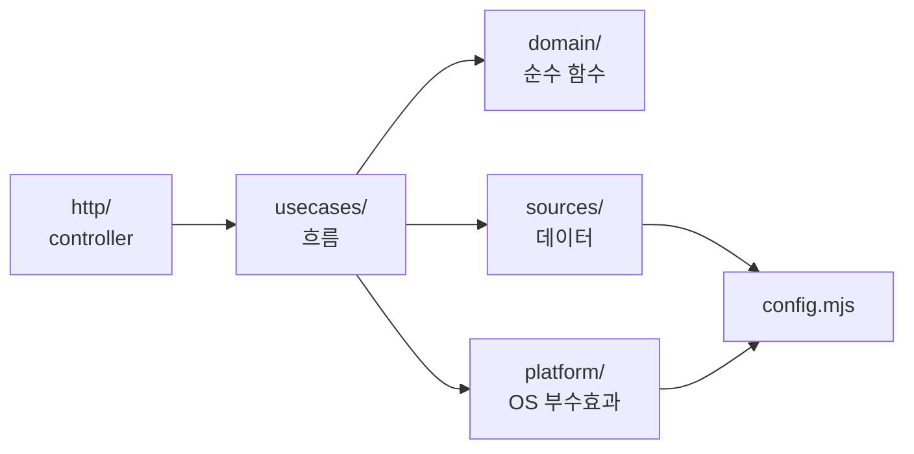

# 설계: 레이어 분리 + 상세 패널 개선

- 작성일: 2026-09-28
- 상태: 구현 완료 (2026-09-28, 커밋 `f5ade35` `0fa775e` `cb3a0ec` `a9f7c95`)
- 범위: ① 백엔드·프론트엔드 폴더/레이어 분리 ② 변경사항 탭 개선 ③ 하단 버튼 정리 ④ 상세 패널 크기 조절
- 근거 조사: 앞선 레퍼런스 조사 (VS Code, GitHub PR, Vibe Kanban, Conductor, Zed, Linear, GitLab, GitHub Primer, Atlassian 등)

## 1. 목적

1. 기능을 더 얹기 전에, 한 파일에 몰린 책임을 레이어별로 나눠 수정 범위를 좁힌다.
2. 변경사항 탭에서 세션이 **작성한 내용**이 바로 보이게 한다.
3. 상세 패널 하단 버튼의 위계를 정리한다.
4. 상세 패널 폭을 드래그로 조절할 수 있게 한다.

## 2. 현재 구조의 사실

| 파일 | 줄 수 | 문제 |
|---|---|---|
| `lib.mjs` | 362 | export 30개. 설정·JSON 입출력·앱 파일·hook 상태·대화 기록·보고서 파싱·상태 판정·결정 저장·git·세션 조립이 한 파일에 섞여 있음 |
| `server.mjs` | 161 | HTTP·보안 검사·라우팅·OS 명령(`open`, `pbcopy`, `claude -p`)·요약 프롬프트가 섞여 있음 |
| `public/index.html` | 1,043 | CSS·마크업·JS 12개 영역(스프라이트, 사무실, 칸반, 패널, 마크다운, 보관함, 알림, 폴링…)이 한 파일에 있음 |
| `test/markdown.test.mjs` | 57 | 마크다운 렌더러를 HTML에서 문자열로 잘라내 `vm`으로 실행. 구조 때문에 생긴 우회 |

변경사항 탭 실측 (2026-09-28, 실제 세션 4개):

| 세션 | 표시 | 원인 |
|---|---|---|
| 새 문서 3개를 만든 세션 | 추적되지 않은 파일 이름만 | 새 파일은 `git diff`에 안 잡혀 이름만 표시 |
| 새 문서 1개를 만든 세션 | 같음 | 같음 |
| 레포 본체에서 연 세션 | 변경 추적 불가 | `worktreePath`가 없으면 git 레포여도 diff를 보지 않음 |
| 브랜치를 되돌린 세션 | 변경 없음 | 정상 |

## 3. 백엔드 레이어

### 3.1 폴더

```
server.mjs                   진입점. `node server.mjs`는 그대로 유지 (src/http/server.mjs 실행)
install.mjs                  hooks 설치/제거 (src/config.mjs만 사용)
hooks/report.mjs             hook. 의존성 없이 단독 실행 (hook 실행 시간 최소화를 위해 의도적으로 분리 유지)
src/
  config.mjs                 환경변수 해석은 여기서만: 경로, 포트, 한도, DRY
  domain/                    순수 함수. 파일·프로세스·현재 시각에 접근하지 않음 (now는 인자로 받음)
    status.mjs               activeDecision, deriveStatus, seatAtDesks
    report.mjs               parseReport, parseTasks, oneLineSummary
    prompts.mjs              CONFIRM_INSTRUCTION, SUMMARY_SYSTEM, nextTaskPrompt, newSessionLink
    diff.mjs                 splitPatch, countLines, isBinaryPatch
    session-view.mjs         toSessionView: 원본 데이터 → API 응답 형태 (동물, 색, ~ 경로 등)
  sources/                   외부 데이터 읽기·쓰기 (저장소 관심사만. 판단 로직 없음)
    json-store.mjs           readJson, writeJsonAtomic
    app-sessions.mjs         앱 세션 메타데이터 (mtime 캐시)
    hook-states.mjs          ~/.claude/office/state
    transcripts.mjs          lastAssistantText (끝부분 읽기 + 캐시)
    decisions.mjs            load / save / clear (+ 구형 confirmed.json 읽기)
    summaries.mjs            read(id) → { text, at } / write
    git.mjs                  git 실행 래퍼와 조회 함수 (아래 3.3)
  platform/                  OS 부수효과 어댑터. DRY 처리는 여기서만
    macos.mjs                openUrl, copyToClipboard
    claude-cli.mjs           runSummarizer(input) → text (격리 옵션 포함)
  usecases/                  흐름 조립. HTTP를 모름
    list-sessions.mjs        listSessions(now) → SessionView[]
    get-changes.mjs          getChanges(session) → ChangesView
    decide.mjs               confirm, hold, archive, restore, undo, listArchived
    next-task.mjs            startNextTask(session, index)
    summarize.mjs            summarize(session)
  http/                      컨트롤러: 입력 정규화 → use-case 호출 → 응답 변환
    server.mjs               createServer, Host/Origin 검사, 정적 파일
    routes.mjs               라우트 표: 'METHOD /api/name' → handler
```

### 3.2 의존 방향



- 화살표 반대 방향 import 금지. `domain/`은 아무것도 import하지 않는다.
- `http/`는 `sources/`나 `platform/`을 직접 부르지 않는다. 항상 `usecases/`를 거친다.
- 부수효과(파일 쓰기, `open`, `pbcopy`, `claude -p`)는 `sources/`와 `platform/`에만 있다.

### 3.3 주요 내부 인터페이스

```js
// sources/git.mjs  — 실패 시 throw 대신 null을 돌려준다 (호출부에서 이유를 판단)
repoRoot(dir)                  → string | null        // git rev-parse --show-toplevel
currentBranch(dir)             → string | null
originName(dir)                → string | null        // origin 원격의 레포 이름
defaultBranch(dir)             → string | null        // origin/HEAD → main → master 중 존재하는 것
mergeBase(dir, ref)            → string | null
trackedPatch(dir, base)        → string               // git diff <base> (커밋 + 작업 트리)
untrackedFiles(dir)            → string[]             // git ls-files --others --exclude-standard
addedFilePatch(dir, file)      → string | null        // git diff --no-index -- /dev/null <file> (exit 1 = 변경 있음)

// usecases/get-changes.mjs
getChanges(session, limits)    → ChangesView           // 4.2
```

```js
// domain/diff.mjs
splitPatch(patch)              → [{ path, status, add, del, patch, binary }]
```

## 4. HTTP 인터페이스

기존 필드는 이름과 의미를 바꾸지 않고, **필드 추가만** 한다.

### 4.1 기존 유지

| 경로 | 변경 |
|---|---|
| `GET /api/sessions` | 없음 |
| `POST /api/confirm·next·hold·archive·restore·undo·open·summary`, `GET /api/archived` | 없음 |

### 4.2 `GET /api/diff/:id` 확장

```ts
type ChangesView = {
  tracked: boolean                 // 기존: 변경을 볼 수 있는 폴더인지
  reason?: 'no-folder' | 'not-git' | 'error'          // 신규: tracked=false 또는 오류일 때 이유
  error?: string                   // 기존
  base: { ref: string, source: 'session' | 'default' | 'head' } | null   // 신규: 무엇과 비교했는지
  stat: string                     // 기존 (추적 파일 기준 shortstat)
  totals: { files: number, add: number, del: number, added: number }     // 신규: 새 파일 포함 합계
  files: FileChange[]              // 기존 path·patch 유지 + 필드 추가, 새 파일도 포함
  untracked: string[]              // 기존 유지 (이름 목록)
  truncated: boolean               // 기존
  empty?: { committed: boolean, uncommitted: boolean }  // 신규: 변경이 없을 때 판단 근거
}
type FileChange = {
  path: string, patch: string                          // 기존
  status: 'added' | 'modified' | 'deleted' | 'renamed' // 신규
  untracked: boolean, add: number, del: number, binary: boolean, tooLarge: boolean  // 신규
}
```

## 5. 프론트엔드 구조

빌드 도구 없이 브라우저 기본 ES 모듈(`<script type="module">`)로 나눈다.

```
public/
  index.html                 마크업 뼈대만
  css/
    base.css                 토큰, 헤더, 레이아웃
    office.css               사무실, 캐릭터, 말풍선
    board.css                칸반
    panel.css                상세 패널, 크기 조절 손잡이, 하단, 메뉴
    markdown.css             보고서·미리보기
  js/
    main.mjs                 부트스트랩: 폴링 → store → 각 view 렌더
    api.mjs                  /api 호출은 여기서만
    store.mjs                상태 { sessions, selectedId, tab, panelWidth } + subscribe
    lib/dom.mjs              $, escapeHtml, el()
    lib/markdown.mjs         renderMarkdown, inlineMd  (Node 테스트에서 바로 import)
    lib/storage.mjs          localStorage 읽기·쓰기 (try/catch)
    views/sprites.mjs        동물 픽셀 정의
    views/office.mjs         사무실, 책상 자리 배정
    views/board.mjs          칸반
    views/archive.mjs        보관함 dialog
    views/notify.mjs         탭 제목, 알림, 소리
    views/toast.mjs          토스트
    panel/panel.mjs          열기·닫기, 헤더, 탭 전환
    panel/resize.mjs         크기 조절 손잡이
    panel/report-tab.mjs     보고서 탭 (+ 다음 작업 항목별 ▶ 진행)
    panel/changes-tab.mjs    변경사항 탭
    panel/actions.mjs        순수 함수: session → { primary, secondary, overflow }
    panel/footer.mjs         actions 결과를 그림 (분할 버튼, ⋯ 메뉴)
```

- 의존 방향: `views/`·`panel/` → `store`·`api`·`lib/`. `lib/`와 `panel/actions.mjs`는 아무것도 import하지 않는다(순수).
- 서버 정적 파일 제공은 `.mjs`·`.css` MIME을 추가한다.

## 6. 기능 설계

### 6.1 변경사항 탭

폴더와 기준 결정 (`usecases/get-changes.mjs`):

| 단계 | 규칙 |
|---|---|
| 폴더 | `worktreePath` → 없으면 `cwd`에서 `repoRoot()` → 둘 다 없으면 `tracked:false, reason:'no-folder'/'not-git'` |
| 기준 | 세션의 `sourceBranch`(존재할 때) → `defaultBranch()` → 현재 브랜치가 기본 브랜치면 `HEAD`(커밋 안 된 변경만) |
| 추적 파일 | `trackedPatch(dir, mergeBase(dir, base))` → `splitPatch` |
| 새 파일 | `untrackedFiles(dir)` 각각 `addedFilePatch` → 전체 추가로 표시 |
| 한도 | 파일당 200KB, 새 파일 최대 30개, 전체 1MB. 넘으면 `tooLarge`/`truncated` |
| 변경 없음 | `empty: { committed, uncommitted }`로 이유 전달 |

- `git add -N`은 쓰지 않는다. 세션의 스테이징 영역을 바꿔 그 세션의 `git status`·커밋에 영향을 준다.
- 화면: 파일 목록에 `+N −M`과 "새 파일" 배지, 앞 3개 파일은 펼친 채 시작. 새 `.md` 파일은 기본 "미리보기"(보고서와 같은 마크다운 뷰어), "원문"으로 전환 가능. 변경이 없으면 "기준(master)과 같음 · 커밋 안 된 변경 없음"처럼 이유를 표시.

### 6.2 하단 버튼 (`panel/actions.mjs`)

`actionsFor(session) → { primary, secondary, overflow }` (순수 함수, 단위 테스트 대상)

| 세션 상태 | primary | secondary | ⋯ 메뉴 (위→아래) |
|---|---|---|---|
| 결재 대기 (보고서·질문·막힘) | 컨펌 · 커밋·PR | 채팅방 열기 | 요약 만들기, 보류 / ― / 아카이브 |
| 결재 대기 + 다음 작업 있음 | OK · 1번 진행 (▾ 2번·3번) | 채팅방 열기 | 컨펌 · 커밋·PR, 요약 만들기, 보류 / ― / 아카이브 |
| 작업 중 | 없음 | 채팅방 열기 | 보류 / ― / 아카이브 |
| 보류 | 보류 해제 | 채팅방 열기 | 요약 만들기 / ― / 아카이브 |
| 완료 | 없음 | 채팅방 열기 | 컨펌 취소 / ― / 아카이브 |

- 채팅 링크가 없는 세션은 "채팅방 열기"를 뺀다.
- 보고서 탭의 "다음 작업" 항목마다 "▶ 진행" 버튼. 하단 분할 버튼과 같은 동작.
- ⋯ 메뉴: Esc·바깥 클릭으로 닫힘, 방향키로 이동. 아카이브는 구분선 아래 빨간색.

### 6.3 크기 조절 (`panel/resize.mjs`)

```js
mountResize(panelEl, { min: 320, maxRatio: 0.7, initial: 380, storageKey: 'office.panelWidth' })
clampWidth(px, viewportWidth, opts) → px      // 순수 함수, 단위 테스트 대상
```

- 패널 왼쪽 가장자리에 6px 손잡이 (`role="separator"`, `aria-orientation="vertical"`, `aria-valuenow`).
- 마우스를 올리고 0.3초 뒤 강조 + "크기 조정" 툴팁. 드래그 중에는 포인터를 손잡이에 고정(pointer capture).
- 더블클릭하면 380px로 복귀. 포커스 후 ←/→로 16px씩 조절. 폭은 localStorage에 저장.
- 폭은 CSS 변수 `--panel-w` 하나로 관리. 1400px 이상 화면에서는 본문 오른쪽 여백도 같은 변수를 따른다.

## 7. 테스트 구조

```
test/unit/          domain/*, lib/markdown, panel/actions, clampWidth  (파일·프로세스 없음)
test/integration/   서버 기동, fixture HOME, 임시 git 레포 (기존 테스트 이동 + 확장)
```

새로 추가할 테스트:
1. `getChanges`: 새 파일 내용 표시, 워크트리 없는 세션, 기준 브랜치 선택 순서, 한도, 바이너리, 변경 없음 이유
2. `actionsFor`: 6.2 표의 모든 행
3. `clampWidth`: 최소·최대·화면 축소 시
4. 정적 파일: `.mjs`·`.css` MIME

## 8. 작업 순서 (단계마다 테스트 통과 후 커밋, 문제가 생기면 그 커밋만 revert)

| 단계 | 내용 | 동작 변화 |
|---|---|---|
| 1 | 백엔드 레이어 분리. `lib.mjs` 제거, 테스트를 새 모듈 기준으로 이동 | 없음 |
| 2 | 프론트엔드 모듈 분리 | 없음 (브라우저에서 화면 비교) |
| 3 | 변경사항 탭 개선 (4.2, 6.1) | 있음 |
| 4 | 하단 버튼 정리 (6.2) | 있음 |
| 5 | 크기 조절 (6.3) | 있음 |
| 6 | README 구조 섹션, 스크린샷 갱신 | 문서 |

## 9. 지키는 원칙

1. 새 dependency 0개, Node 표준 라이브러리와 git만 사용
2. `const`만 사용
3. 기존 API 필드는 바꾸지 않고 추가만
4. hook은 단독 실행 유지
5. `node server.mjs`, `node install.mjs`, `npm test` 사용법은 그대로

## 10. 구현하며 달라진 점

1. 프론트 모듈 확장자는 `.mjs`가 아니라 `.js`. 서버가 이미 `.js`를 올바른 MIME으로 제공하고, `package.json`이 `"type": "module"`이라 Node 테스트에서도 그대로 import된다.
2. `platform/claude-cli.mjs`의 `runSummarizer(input, systemPrompt)`는 시스템 프롬프트를 인자로 받는다. `SUMMARY_SYSTEM`은 `domain/prompts.mjs`에 있고, `platform → domain` import를 만들지 않기 위해서다.
3. `totals.added`와 `.md` 미리보기는 **커밋 여부와 상관없이** 새 파일(`status: 'added'`)이면 적용한다. 처음 구현은 아직 커밋 안 된 새 파일만 셌는데, 실제 세션 대부분이 새 문서를 이미 커밋해서 "새 파일 0"으로 보였다.
4. 헤더 카운터 갱신은 별도 뷰 파일 없이 `views/board.js`에 둔다(칸반 분류와 같은 계산).
5. 패널 폭 저장은 `lib/storage.js`의 `loadPanelWidth`·`savePanelWidth`에 둔다.
